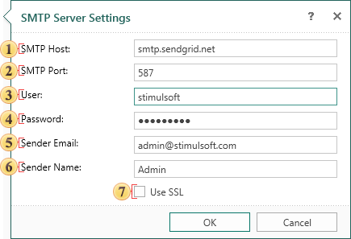

## SMTP Server Settings

For sending emails you need to use a SMTP server. In order to bring up the SMTP server settings, press the Settings button of the **SMTP server (SMTP Server Settings)** the **System** tab.

 The field **SMTP Host**. Here you specify the address of the SMTP server.

 The field **SMTP Port**. Here you specify the port of connection to the server.

 The field **User**. The username (login) to connect to the SMTP server is specified in this field.

 The field **Password**. In this field the password is specified to authentication on the SMTP server.

 The field **Sender Email**. Specifies the e-mail address that will appear to the recipient as a sender email.

 **Use SSL**. This option provides the ability to apply a cryptographic cipher to e-mails. If this box is checked, the cipher is applied.
