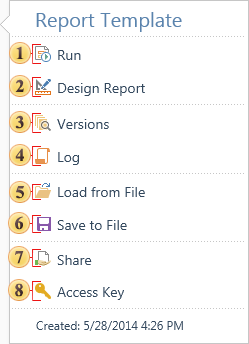
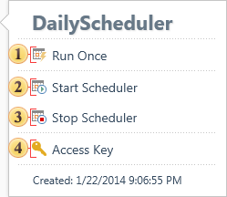

## Menu Actions

The menu **Actions** contains commands used for possible actions with the selected item. Depending on the type of an item, the number of steps may vary. Consider the example of the menu **Actions** of the item **Report**, because you can perform the greatest number of actions with this item. Below is the menu.

 The command **Run** is used to render reports and load it to the viewer.

 Using this command the report is loaded to the report designer.

 Using this command calls the menu for the selected item of the selected version.

 Using this command calls the History menu for the selected item.

 Using this command the dialog box for selecting a report and then upload it to the item Report is called.

 Using this command the dialog box to save the selected report to a file is called.

 Using this command you can make the item available for certain persons

 Using this command an automatically generated unique key item is created. The unique key item is required for future access to this item when using the API of the report server by third party applications. After selecting this command, the key will be displayed on the panel Access Key.

The menu **Actions** for all elements of the type Scheduler will contain other commands. The picture below shows such a menu for the Scheduler.

 This command runs the scheduler. The scheduler will be executed one time not by a schedule.

 With this command, the Scheduler is running according to the schedule.

 The commands stops the Scheduler.

 Using this command an automatically generated unique key item is created. The unique key item is required for future access to this item when using the API of the report server by third party applications. After selecting this command, the key will be displayed on the panel Access Key.
