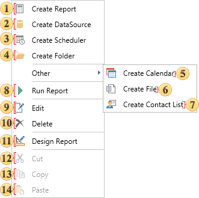
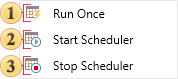

## Context Menu of Navigator

The main commands of the report server are duplicated in the context menu. This menu will appear when you right-click a mouse (or holding your finger on mobile devices or other alternative action) in the toolbox. Below is the context menu:

As can be seen from the picture above, the top part of the menu is represented with the commands to create basic items:

 The command invokes a menu to create a report or upload it from the file.

 The command adds a new data source.

 The command is use to schedule commands to be executed.

 The commands creates folders in the list of items. They are needed to organize and store items and other folders. Using to create a hierarchy of folders in the list of items of the report server.

Commands to create items are placed in a separate section:

 The command is used to invoke the **Calendar**. In the calendar, for example, you can create a schedule to run the scheduler.

 The command is used to add a file to the list of items in the report server.

 The command is used to call the menu to create a list of contacts. For example, the contact list may be used by the scheduler to send the result by email.

 The command is present only in the context menu of an item Report. This command runs a report for rendering and opens the tab view reports.

 This command calls the edit menu of the selected item.

 The command deletes selected item.

 The command is used to call the report designer and is present only in the context menu of an item Report.

 The command is used to cut items to the clipboard.

 The command is used to copy items to the clipboard.

 The command is used to paste items from the clipboard.

Also you should consider that in the context menu of the **Scheduler** the commands to control the scheduler will be present instead of the command Run Report:

 This command starts the scheduler at once not by a schedule.

 Using this command the scheduler is running and it is executed according to the schedule.

 Using this command the scheduler stops.
