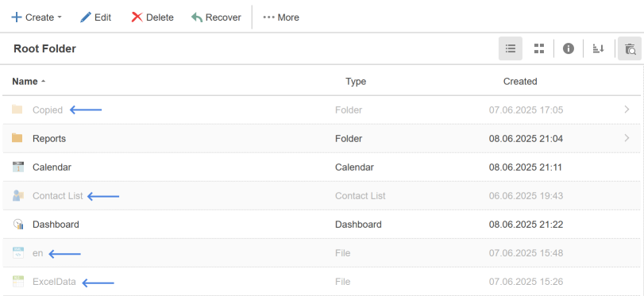
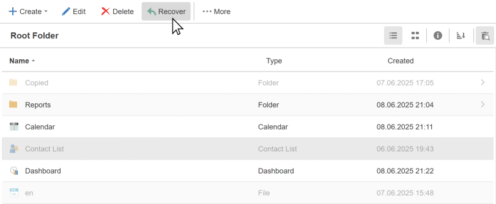

## Recycle Bin

When you delete items, you can move them to the trash or completely remove them from the server.

* If the **Move to Recycle Bin** is enabled, the item will be moved to the basket.

* If the **Move to Recycle Bin** is disabled, the item will be removed from the server.

To view the contents of the basket, you should click the button **Recycle Bin**. After that, the items in the basket will be displayed in the tree (marked as deleted items):

As you can see in the picture above, the deleted items are displayed, keeping its location in the hierarchy. In other words, the deleted item retains binding to the location in the tree.

> **Information**
>
> It should be noted that when a folder is deleted (or restored), all items and subfolders within it will also be deleted (or restored).

**Recovering items**

Any item deleted to the **Recycle Bin** can be restored. To do this:

* Enable Recycle Bin mode;

* Select the item and select the **Recover** command on the server toolbar.

The item will be restored to the folder from which it was deleted. It is also possible to restore several items at once if you select them simultaneously (using the **Ctrl** or **Shift** buttons). It is important to understand that:
* Restoring a deleted folder entails restoring all the items contained in it;
* When restoring an item from a deleted folder, the folder will be restored automatically. The remaining items from this folder (or folders, if the nesting level is greater than 1) will not be restored.

**Emptying the recycle bin**

There are no special commands to empty the recycle bin. You can remove items from the recycle bin:

* Select the necessary elements using the **Ctrl** or **Shift** buttons, and click **Delete** on the **Home** tab;

* Restore the files and delete them again without putting them into the recycle bin by unchecking the **Move to Recycle Bin** flag.
