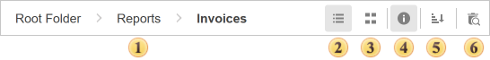
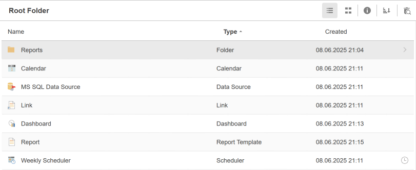
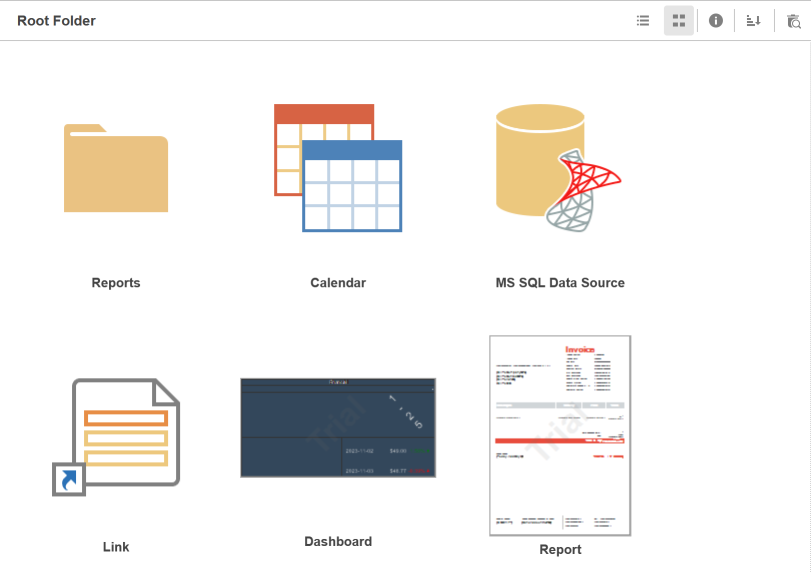
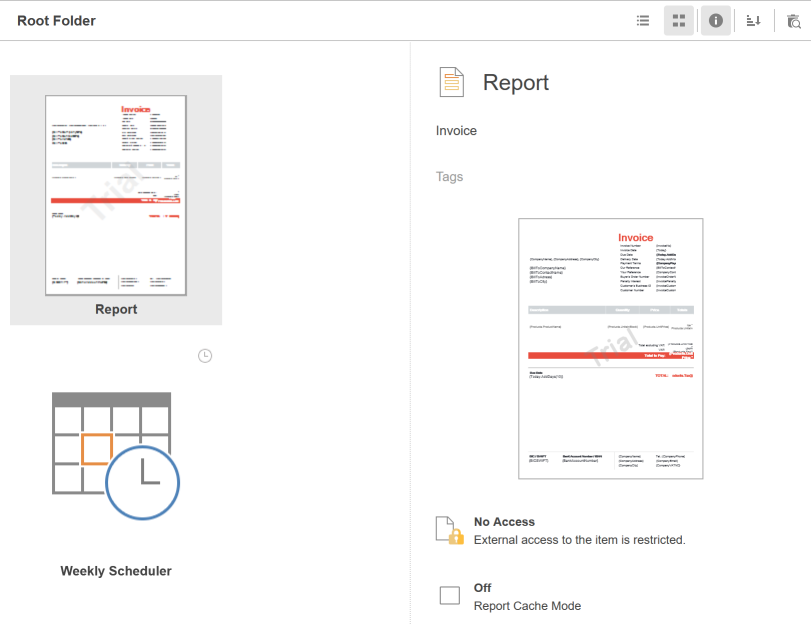
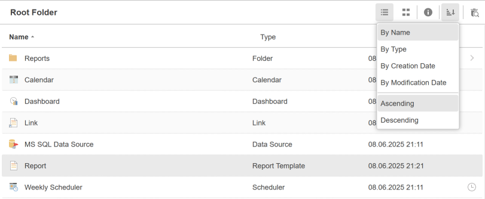
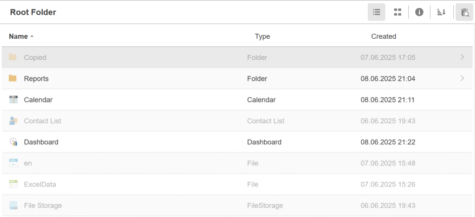

## Display panel

The display panel includes commands to control modes of displaying server items:

 The full path to the current directory, the folder in which the user is located.

 The button to enable the List mode. The items will be displayed a list of items with information about their type and date of creation.

 The button to enable the **Grid** mode. The list of items will look like big icons as a grid.

 The button is used to enable the **Details** panel. If you click this button, it will display an additional panel with detailed information of items.

> **Information**
>
> On the **Details** panel, you can change the **Name** and **Description** of the selected item. To do this, click on the name or description and change the text.

 The button to sort items. It contains the drop-down list, where you can define the type and direction of sorting.

 The button to enable the [Recycle Bin](Recycle_Bin.md) mode. If the button is enabled, it will display the items of the bin.

