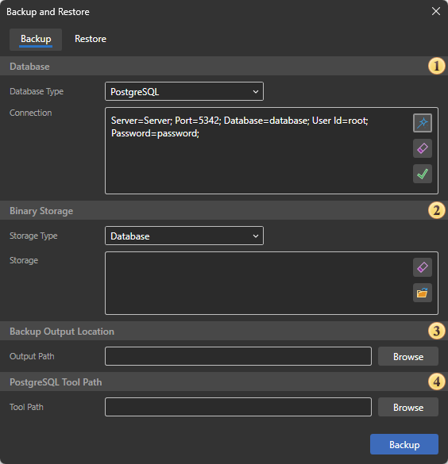
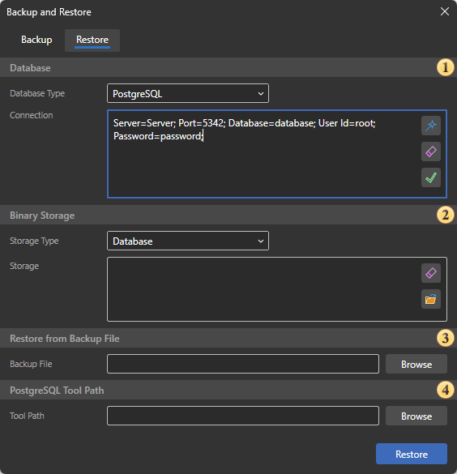

## Backup and Restore

**Backup and Restore** is a specialized tool designed to create backups of Stimulsoft Server service data and restore data from a backup. You can launch the **Backup and Restore** tool from the Server Controller context menu or by directly running the Stimulsoft.Server.BackupAndRestore.exe executable file located in the installed Stimulsoft Server folder. By default, the file is located in the following directory: C:\ProgramData\Stimulsoft-Server\Software-Releases\202*.*.*\.

> **Note**
>
> The actual file path may vary depending on the Stimulsoft Server version and installation settings.

**Backup**

A Stimulsoft Server backup is a ZIP archive that includes:

- Stimulsoft Server navigator items: reports, report snapshots, exported files, folder structures, and other items;
- connections to data sources and related settings;
- users and user accounts;
- administrators and managers;
- roles and related access settings;
- workspaces;
- other service objects and data required for Stimulsoft Server operation.

**Backup and Restore Editor**

The editor contains two tabs:

- Stimulsoft Server Backup;
- Restore from Backup.

**Backup**

Backup is performed without connecting to the navigator. You only need to specify the connection string to the data storage and the path for saving the backup. The backup editor is shown below:

 The data storage settings group, where you need to specify the database type and connection string.

 In the Binary Storage group, you can change the storage type for the content of server items and specify the path to this storage.

 Settings for the path to the output backup file.

 An optional setting available only for PostgreSQL databases. Allows you to specify the path to the backup creation tool.

**Restore**

To perform a restore, you must first create at least one backup. The data storage type must match the type of storage from which the backup was created. The restore editor is shown below:

 The data storage settings group, where you need to specify the database type and connection string.

 In the Binary Storage group, you can change the storage type for the content of server items and specify the path to this storage.

 Settings for the path to the backup file from which the restore is performed.

 An optional setting available only for PostgreSQL databases. Allows you to specify the path to the restore tool.
