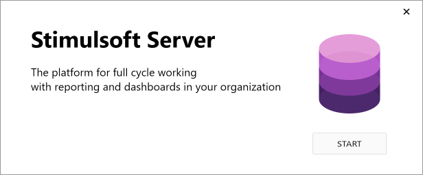
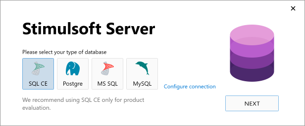
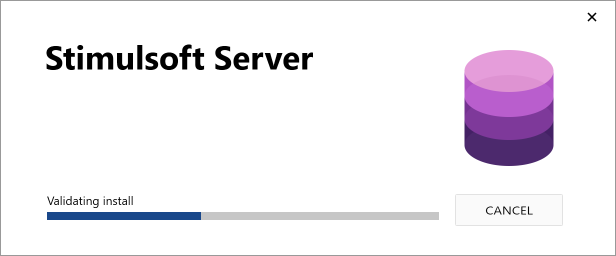
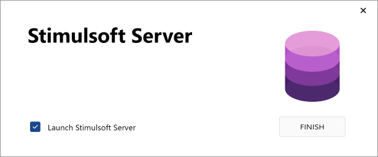
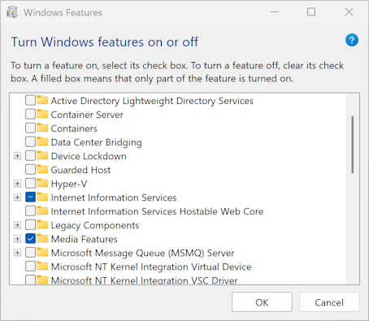

## Installation

> **Information**
>
> This chapter provides a step-by-step guide on how to install Stimulsoft Server on a Windows operating system. [For information on using Stimulsoft Server in a Docker container, please refer to the corresponding section](Docker/index.md).

To install Stimulsoft Server, follow these steps:
Step 1: Download the Stimulsoft Server distribution package, for example from the official website - [https://www.stimulsoft.com/ru/downloads/business](https://www.stimulsoft.com/ru/downloads);

Step 2: Run the downloaded installer.
Step 3: After launching the installer, it will initialize the setup process by checking the [system requirements](System_Requirements.md) system requirements for Stimulsoft Server.

Step 4: Once the initialization is complete, a window will appear. Click the Start button to begin the installation process.

Step 5: The installer will then prompt you to select the type of database.

Step 6: No user interaction is required at this stage. The installation process continues automatically.

Step 7: After the installation is successfully completed, click Finish to close the installer window. If the Launch Stimulsoft Server checkbox is selected, the server will start automatically.

Install .NET Framework 4.5 and IIS

Let's consider how to install **.NET Framework 4.5** and **Internet Information Services**. A prerequisite for the installation of the platform and service is the availability of an internet connection.

* Installing **.NET Framework 4.5**

Before starting the installation, you should review the system requirements.

| Criterion | List |
| --- | --- |
| Supported OS | Windows 7 Service Pack 1; Windows Server 2008 R2 SP1; Windows Server 2008 Service Pack 2; Windows Vista Service Pack 2 Windows Vista with 2 (SP2) (x86 and x64) Windows 7 with 1 (SP1) (x86 and x64) Windows Server 2008 R2 with 1 (SP1) (x64) Windows Server 2008 SP2 (x86 and x64) Windows 10 |
| Hardware Requirements | Processor 1 GHz and higher RAM 512 Mb 850 Mb free space (x86) 2 Gb free space (x64) |

After that, you need to download the installer from the official[website](http://www.microsoft.com/en-US/download/details.aspx?id=30653) and install the product.

* Installing **Internet Information Services (IIS)**

The installation procedure of the service can be performed through the Windows OS interface:

1. Click the button **Start** and select **Control Panel**.
2. In the **Control Panel**, click **Programs**, and then **Turn Windows Features on or off**.
3. In the **Windows Features** dialog box, click **Internet Information Services** and then click **Ok**.

> **Information**
>
> To install IIS, you need to be "Administrators".

More information about IIS can be found on the [official website of Microsoft](http://technet.microsoft.com/en-us/library/cc731911.aspx).
