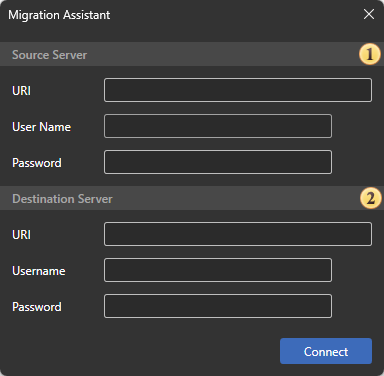
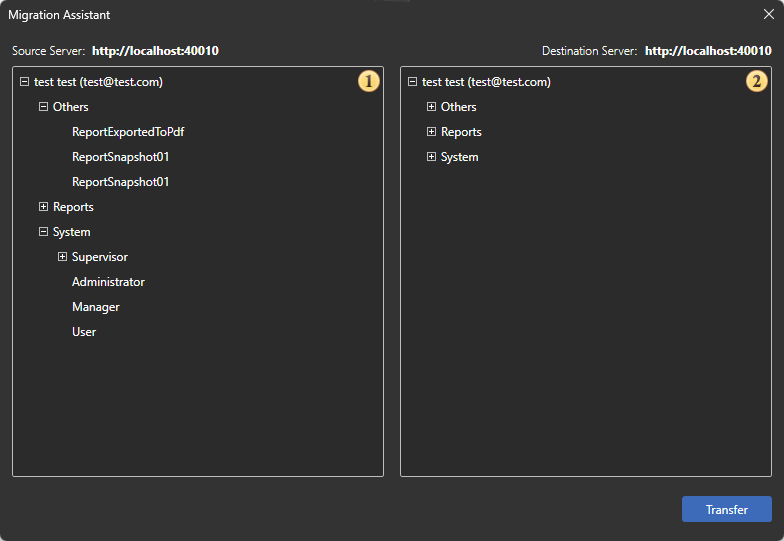

## Migration Assistant

The **Migration Assistant** is a specialized tool for transferring Stimulsoft Server service data from one Stimulsoft Server instance to another. The tool allows you to transfer data between different storage systems without manually copying and configuring service tables. For example, the Assistant can be used to transfer data between test and production Stimulsoft Server instances, when migrating to a new server, or when changing the data storage system. You can launch the Migration Assistant from the Server Controller context menu or by directly running the Stimulsoft.Server.MigrationAssistant.exe executable file located in the installed Stimulsoft Server folder. By default, the file is located in the following directory: C:\ProgramData\Stimulsoft-Server\Software-Releases\202*...

> **Note**
>
> The actual file path may vary depending on the Stimulsoft Server version and installation settings.

**Migrated Data**

The Migration Assistant transfers Stimulsoft Server service data, including:

- Stimulsoft Server navigator items: reports, report snapshots, exported files, folder structures, and other items;
- connections to data sources and related settings;
- users and user accounts;
- administrators and managers;
- roles and related access settings;
- workspaces;
- other service objects and data required for Stimulsoft Server operation.

The set of data that can be migrated may depend on the Stimulsoft Server version and the structure of the service tables in the source and target instances.

**Migration Assistant Editor**

The Migration Assistant Editor consists of two main stages:

1. establishing a connection to the source and target Stimulsoft Server instances;
2. analyzing service tables and transferring data.

**Connecting to Stimulsoft Server Instances**

At the first stage, specify the connection parameters for the source and target Stimulsoft Server instances.

 In the Source Stimulsoft Server field group, specify the parameters of the instance from which the data will be transferred:

- URI - the address of the Stimulsoft Server navigator;
- User Name - the name of a user account with the permissions required to access the data;
- Password - the password for the specified account.

 In the Target Stimulsoft Server field group, specify the parameters of the instance to which the data will be transferred:

- URI - the address of the Stimulsoft Server navigator;
- User Name - the name of a user account with the permissions required to perform the operation;
- Password - the password for the specified account.

After successfully establishing a connection to both Stimulsoft Server instances, the Assistant analyzes the structure of the service tables and prepares the data for transfer.

**Analyzing Service Tables and Transferring Data**

At the second stage, information about the service tables of the source and target Stimulsoft Server instances is displayed. The window contains:

 a list of the source Stimulsoft Server service tables;

 a list of the target Stimulsoft Server service tables;

Before starting the transfer, it is recommended that you check the connection parameters and make sure that the correct source and target Stimulsoft Server instances are selected. To start the operation, click Transfer. The data from the source Stimulsoft Server service tables will then be transferred to the corresponding tables of the target instance. The duration of the operation depends on the volume of data being transferred and the performance of the storage system in use.

> **Information**
>
> Note that existing data in the target Stimulsoft Server may be modified or lost during the transfer. Before performing the operation, it is recommended that you [create a backup copy](Backup_And_Restore.md) of the target Stimulsoft Server instance data. It is also recommended that you verify the specified connection settings in advance and make sure that the required servers are selected as the source and target instances.
