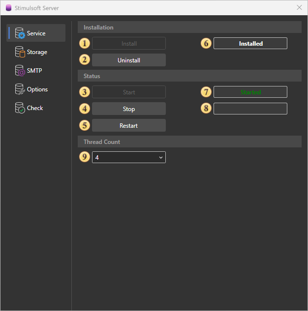
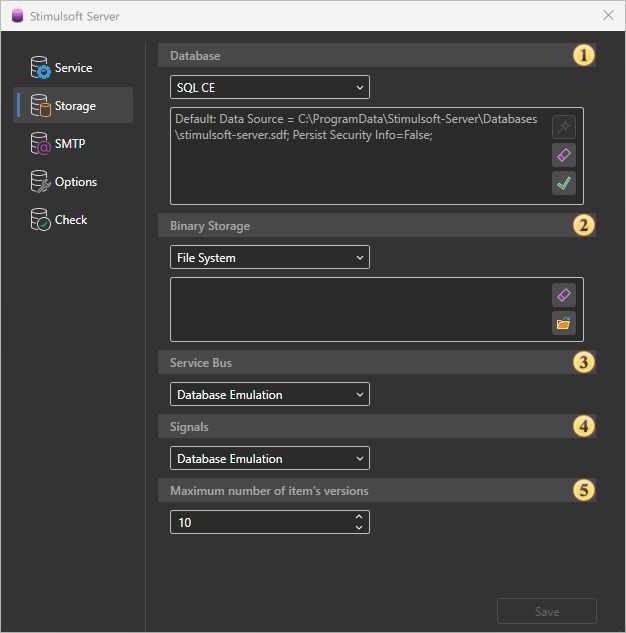
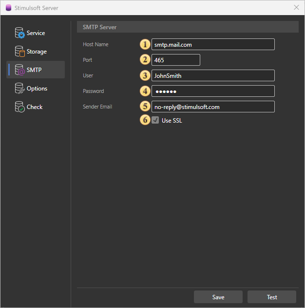
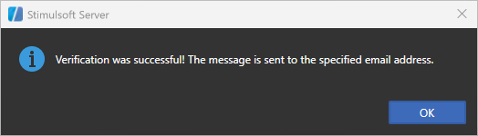
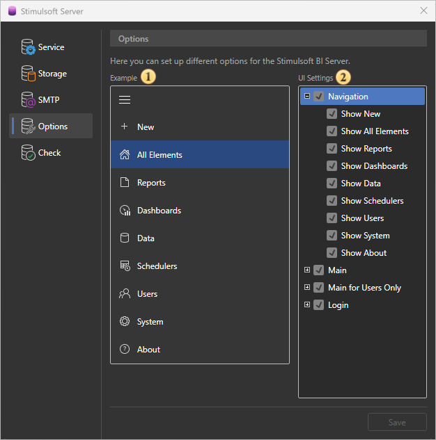
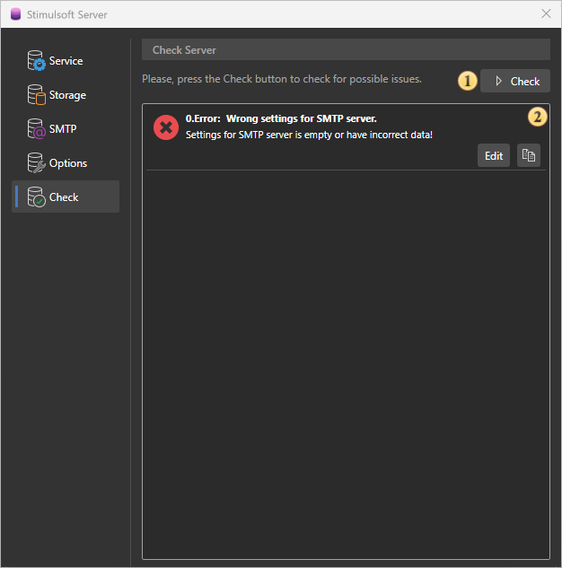

## Server Controller

The server controller can control Stimulsoft Server. This utility is installed with the server and folded into a tray on the taskbar. With this utility, you can delete, stop, start, and restart the report server, change the database used by the server, check for server issues. All commands to control the server are separated into tabs: [Service](#Service), [Storage](#Storage), [SMTP](#SMTP), [Check](#Check). Consider these tabs in more detail.

The tab Service

On the Service tab, you can find the server controls.

 The install button of Stimulsoft Server. The button is disabled when the server is installed.

 The uninstall button of Stimulsoft Server. Uninstalls the report server.

 The **Start** button runs the report server.

 The **Stop** button stops the report server.

 The **Restart** button the report server.

 The field shows the current state of the server.

 This field displays the status of the **running** server. If the server is stopped, this field is blank.

 This field displays the status when the server is **stopped**. If the server is running, this field is blank.

 In the Thread Count group, you can specify the number of server threads.

The tab Storage

Stimulsoft Server can be run only on the following types of databases - **MySQL**, **MS SQL**, **SQL CE**.

> **Information**
>
> It is important to understand that the server saves its structure in these databases MySQL, MS SQL, SQL CE.

 The **Database** field specifies the database for Stimulsoft Server.

 The **Binary Storage** field specifies storage for server items.

 The **Service Bus** field specifies the storage of server tasks.

 The **Signals** field specifies the storage of server signals.

 The Maximum number of item versions field specifies the number of versions of an item.

The tab SMTP

For sending emails, you need to use an SMTP server.

 The field **SMTP Host**. Here you specify the address of the SMTP server.

 The field **SMTP Port**. Here you specify the port of connection to the server.

 The field **User**. The username (login) to connect to the SMTP server is specified in this field.

 The field **Password**. In this field, the password is specified to authentication on the SMTP server.

 The field **Sender Email**. Specifies the e-mail address that will appear to the recipient as a sender email.

 **Use SSL**. This option provides the ability to apply a cryptographic cipher to e-mails. If this box is enabled, the cipher is applied.

After entering the smtp server settings, you must click the Save button. Also, on this tab there is a Test button to check the smtp server settings. When clicked, a test letter will be sent to the specified address.

> **Information**
>
> If, after saving the SMTP server settings, the test letter is not delivered to the specified email address, you should run the restart command on the server. To do this, click the Restart button on the Service tab in the server controller.

The tab Options

This tab is where you configure the settings.

 Example of User Interface Display

 User Interface Configuration. Here you can enable or disable the visibility of various sections and features for users.

In the Navigation section, you can configure the display of:In the Navigation section, you can configure the display of:

  * Show New. Displays the option to create new elements

  * Show All Elements. Displays the "All Elements" item

  * Show Reports. Displays the "Reports" item

  * Show Dashboards. Displays the "Dashboards" item

  * Show Data. Displays the "Data" item

  * Show Schedulers. Displays the "Schedulers" item

  * Show Users. Displays the "Users" item

  * Show System. Displays the "System" item

  * Show About. Displays the "About" item

In the Main section, you can configure the display of:

  * Show More. Displays the More button

  * Show Versions. Displays the Versions button

  * Show Using. Displays Using

  * Show Access Key. Displays the Access Key button

  * Show Upload. Displays the Upload button

  * Show Download. Displays the Download button

In the Main for Users Only section, you can configure the visibility of the Main section only for regular users (without administrative rights).

In the Login section, you can configure:

  * Show Sign Up. Displays the Sign Up button

The tab Check

On this tab, you can check for errors, warnings, and information messages in the server.

 The button to start the test of the report server on errors, warnings, and information messages.

 The panel displays a general list of messages and alerts.
