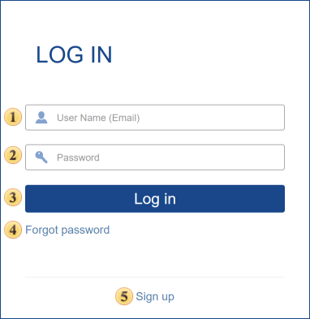
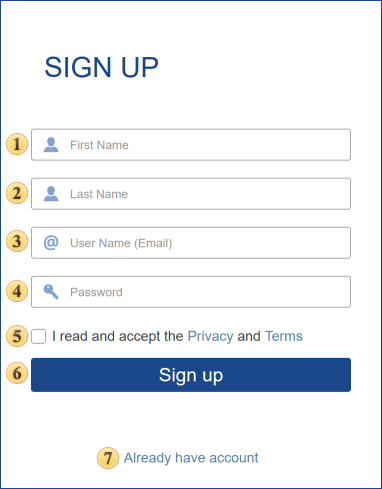
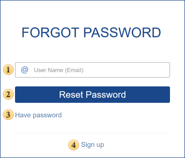

## Login Dialog

When you run **Stimulsoft Server**, the first menu displayed is user authentication. Here you must specify the username and password of an account to get to the workspace. Below is the login dialog:

 In this field, you enter a user name (login) of your account. A login account can be an email address provided in the process of registration.

 In this field, you specify the current password for your account.

 If you check this flag, the Login and Password fields will be automatically populated with authentication information, using which the last entry was made with the computer.

 When you click this button, the entered authentication information is verified. If authentication credentials are correct, there will be signing in.

 Click this item, if you need to restore your password.

 This button redirects you to the registration form of a new account with a new workspace.

**Sign Up**

If you want to register a new account and workspace, go to the Registration menu and fill in the user profile.

 Put your first name.

 Put your second name.

 Type your email address (login) of the future profile. You should remember that the email address provided here is the login to access the account.

 Type the password to your account. Minimum 6 characters are allowed in the password.

 Go to the terms of the license agreement. Do not forget to read this.

 After clicking this button, a new account with a working space will be created.

 Click this menu item if you do not need registration or already have the account.

**Forgot Password**

Sometimes you need to log in to your account but forgot your password. To recover your password, use the following menu.

 This field specifies the Username (email address) that is used for logging into your account.

 After you click this button, your current password will be reset, and a new one will be created and sent to the email address specified when filling the registration form.

 This button redirects you to the registration form of a new account with a new workspace.

 This button closes the menu.
