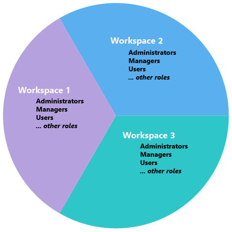
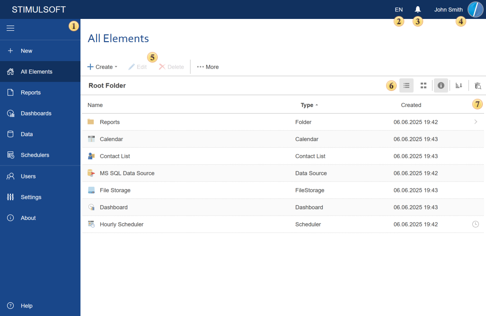

## Structure

**Stimulsoft Server** is a sophisticated software that has a client-server architecture. Data of different users are separated by different workspaces. The picture below shows a system with three **workspaces**:

Users who have the role of the **Supervisor** manage the server. They have absolute rights in all **workspaces** on the server. In particular, they have the right to create and delete workspaces. Besides, each workspace has **administrators**, **managers**, **users**, and other [roles](../Tabs/Users/Add_Role.md) that perform certain activities within their workspace.

**Stimulsoft Server** is a client part of the server, using what actions are carried out on the server. Consider the structure in more detail.

 The **Bookmarks** panel of the server.

 The **Localization** button. Click this button to expand the list of server localization.

 The **Notifications** button. New notifications will be created when various operations with the server item will be performed. Click this button to show a log of server notifications.

 Click this button to open an account profile.

 The toolbar contains basic commands to work with server items.

 The view modes panel of the item list.

 The list of items in this server workspace.

> **Information**
>
> If an account (i.e., a user assigned to a specific role) does not have permission to view certain types of elements, those elements will be hidden from that account, and the list of elements may appear differently. Additionally, if the user has a different root folder assigned, the list of elements will also differ accordingly.

**Run in Background**

These operations can be performed in the background. The background mode provides the ability to perform an unlimited number of activities simultaneously. In this case, the number of operations in the background mode depends on the technical abilities of the server. To enable the background mode, you must check the Run in Background flag in the dialog window of the operation (removal, restoration, cleaning the recycle bin).
