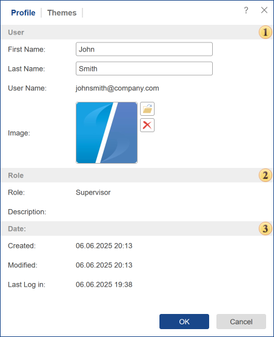
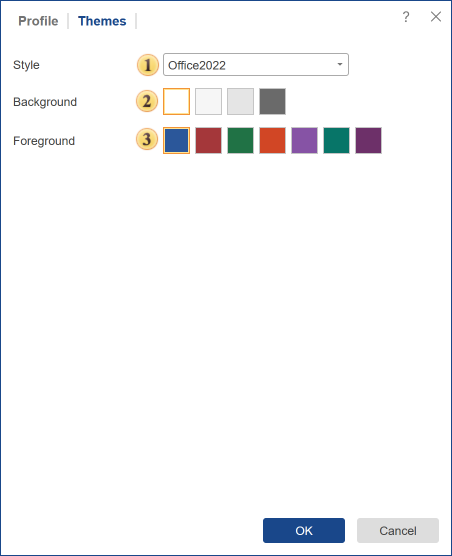

## Profile

In the menu Settings menu, you can change your account settings. You can find Parameters in the following tabs:

The tab Profile.
It provides information on the current account. It is represented by the following groups of items.

 The group User includes personal data such as user name, email address, and the ability to upload a picture (avatar). If the picture is not uploaded, then, instead of the user's avatar, the graphic element of a specific color, which is located in the center of the first letter of the name and surname, will be displayed.

 The tab Role provides information on supplies of the current account to a particular role in this workspace. You may also see the description of the established role.

 The group **Date** contains information about the actions of the current account, date and time of creation, modification, and last authentication.

The tab Themes.

In this tab, you can change the color scheme of the UI, as well as its style.

