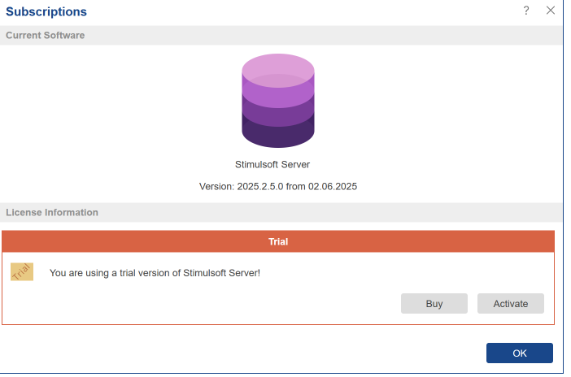
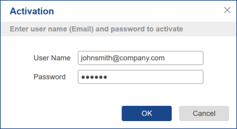
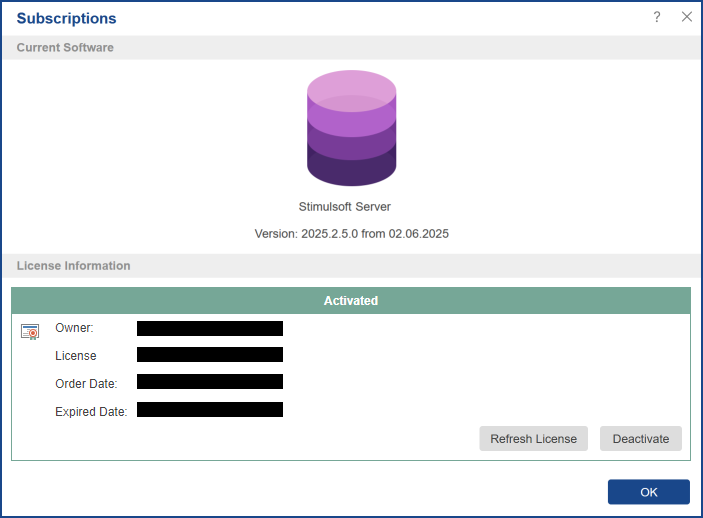

## Subscriptions

When you click **Subscriptions**, the **Subscriptions** window will pop up. Here you can find information about the current version of the report server and activate it.

As you can see in the picture above, the version is trial. To get a licensed version of **Stimulsoft Server**, click **Activate** and enter the registration information (username and password).

> **Information**
>
> To obtain registration information, click **Buy**, choose the type of the license, and follow the instructions.

After successful activation, the field **License Information** will look like in the picture below.

As can be seen from the picture, this field indicates the status of the license (activated) and contains the following information

  * **Owner**. It specifies the user name of the license holder.

  * **License**. In the above example, the license up to 5 users.

  * **Order Date**. Shows the date when the order was paid.

  * **Expired Date**. The date when the subscription expires.

There are also buttons Refresh License and Deactivate. When clicked, they will respectively update the license validity period or deactivate the license.
