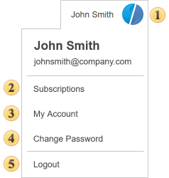
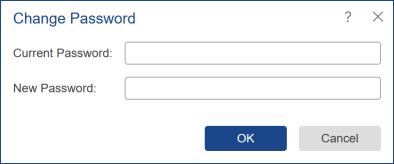

## Menu Account

From the **Account** menu, you can set up a user profile. The menu is located in the upper right corner of the Navigator, under the window control buttons.

 The **Account Information** field. Consists of a graphic part, user's full name, and email address. In the center of the graphic item, the first letter of the name and the first letter of the last name is displayed.

 Select the [Subscriptions](Subscriptions.md) command to activate the license or purchase the software.

 The menu [Profile](Profile.md) has controls to configure the server interface and navigator.

 Select the **Change Password** command to change the password for the current account. In the form opened, you will need to enter the current password and the new password.

 Select this option to **Logout** of the current profile.
