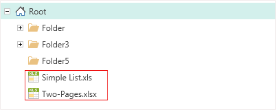
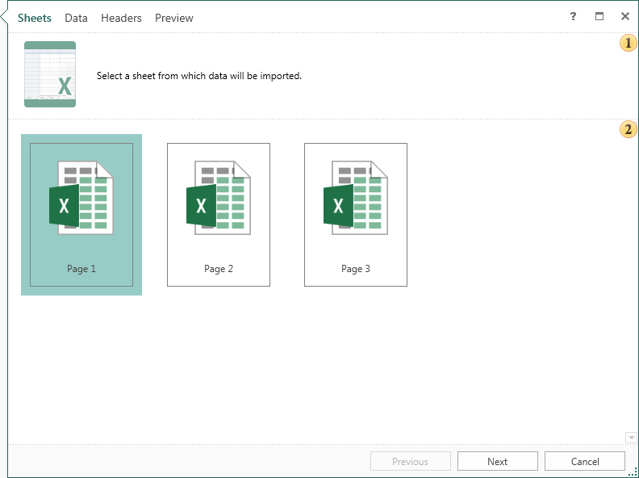
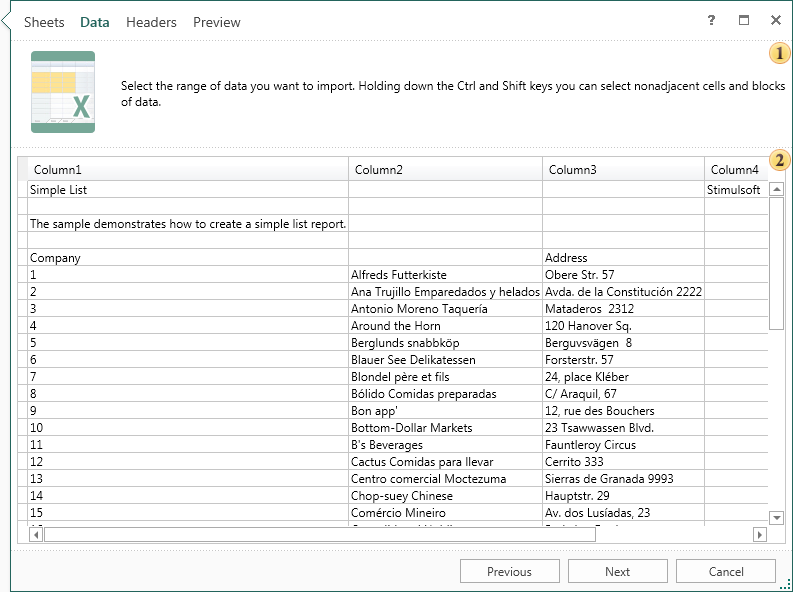
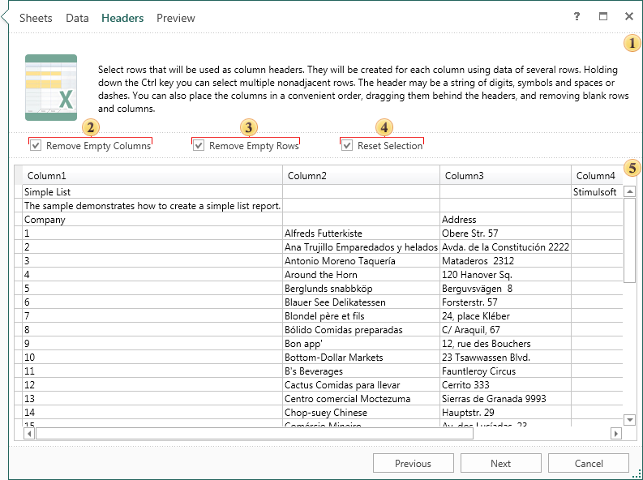
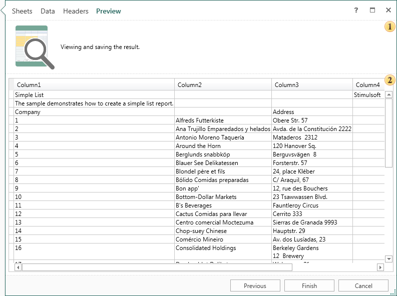

## Excel Files

Consider obtaining data from the Excel file. First you need to load the Excel file into the item tree:

  * The Excel file can be simply dragged & dropped) from any place into the item tree;

  * Create the File item and load the Excel file into it.

You should now select the Excel file and select Import Data to display the Import Data Wizard. Extracting data from the Excel file will take a few simple steps plus defining parameters:

* Step One - **Sheets**. This step is necessary to select an Excel sheet, from which data will be imported. In the example below, the first sheet of the Excel file is selected.

 This field contains a brief description of the actions at this stage.

 The field contains a list of pages of the Excel file.

* Step Two - **Data**. In this step represents Excel file columns that contain data. If you just click Next, all data will be imported. Also, it is possible to allocate certain data, and then import them. Selection is carried out using the Ctrl and Shift buttons. The Ctrl key is held in the allocation of contiguous entries. Held down the Shift button to select contiguous entries:

 This field contains a brief description of the actions at this stage.

 The data columns and headers.

* Step Three - **Headers**. In this step, headers for data columns are defined. To do this, select the row (or rows) with data to determine the parameters and headers will be created automatically. Selecting multiple lines can be done using the Ctrl button (for non-contiguous selection) or Shift (for contiguous selection). If at this stage, no one line will be selected the headers remain unchanged.

 This field contains a brief description of the actions at this stage.

 The **Remove Empty Columns** option. If checked, all empty columns will be removed. If unchecked, then empty columns will be present in the data table.

 The **Remove Empty Rows** option. If checked, all empty rows will be removed. If unchecked, then empty rows are present in the data table.

 The **Reset Selection** option. If checked, the selection will be reset.

 The data columns and headers.

> **Notice**
>
> * **Notice:** Punctuation marks and special characters cannot be used in the column header. This is the limitation in the C# language. Therefore, at the presence of illegal characters, the header will remain unchanged.

* Last step - **Preview**. This step provides an opportunity to preview the future data table into its final form. If necessary, you can go back to previous steps and change settings. To complete importing data, you must click Finish:

 This field contains a brief description of the actions at this stage.

 Created data columns and headers.

Now, based on these tables, you can build reports.
