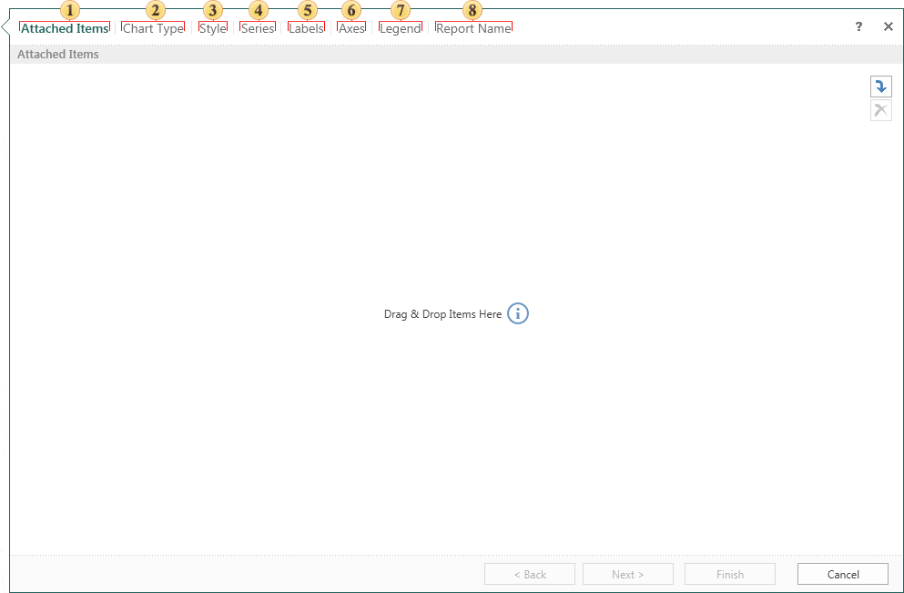

## Report with Chart

Creating a report with chart using the wizard includes 8 steps. Not all of them are mandatory.

 Attach other items to the report. For example, images, files, data sources, etc. This is a mandatory step.

 Select the chart type.

 Select the chart style.

 Add the chart series. The chart should be at least one series.

 Define a number of labels by selecting them and changing the type of parameters.

 Determine the parameters of the axes in the chart.

 Set the legend and change its parameters implemented at this stage.

 Give the name to the report item and write description for the report, if necessary. This is a mandatory step.
