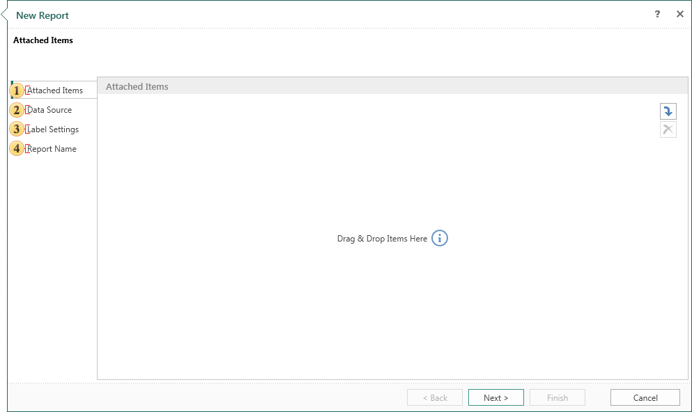
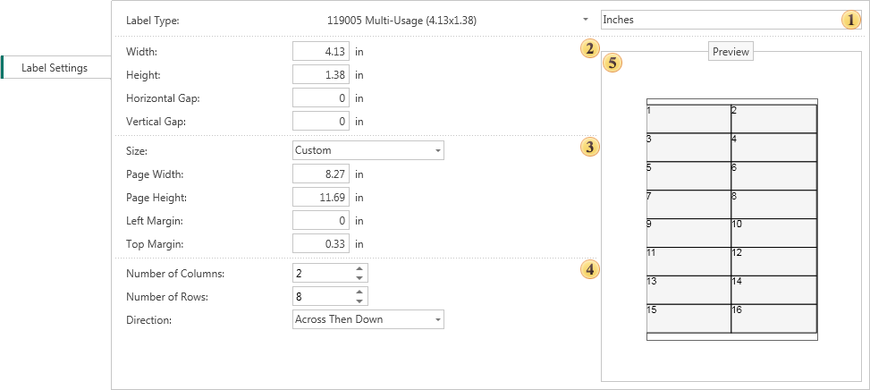

## Report with Label

Creating a report with label using the wizard includes 12 steps. Not all of them are mandatory.

 Attach other items to the report. For example, images, files, data sources, etc. This is a mandatory step.

 Select the data source on which a report will be created. This is a mandatory step.

 This step defines the label settings.

 Give the name to the report item and write description for the report, if necessary. This is a mandatory step.

 **Type Panel**. Set the report units and Label Type.

 **Panel size label**. Change the size of the label.

 **Panel size pages**. Select the page size or manually set the value of the width and height of the page, as well as its borders.

 **Panel configuration label**. Customize the label, specify the number of rows and columns, and select the direction of placing labels on the page.

 **Preview Panel**. Preview the labels on the page, certain parameters.
