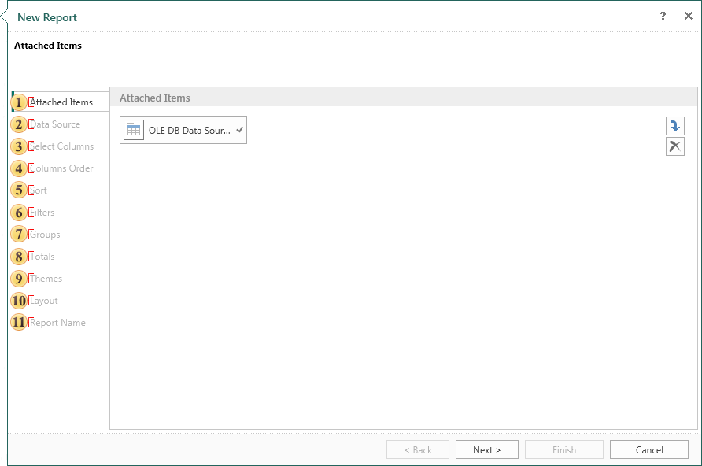

## Standard Report

When you create a report using the **Standard Report** wizard, the report will contain one **Data Band** or one **Data Table**. Creating a report using the wizard includes 11 steps. Not all of them are mandatory.

 Attach other items to the report. For example, images, files, data sources, etc. This is a mandatory step.

 Select the data source on which a report will be created. This is a mandatory step.

 Select data columns to be output in a report. This is a mandatory step.

 Specify the order of placing the columns on the **Data Band**. The order of the columns from top to bottom corresponds to the order of the columns in the report from left to right. Changing the order in the report wizard is possible with the help of two buttons on the control panel of this step.

 Sort data if needed.

 Sometimes you need to show not the whole list of data but a specific range of data. For example, display the products cost from 40 to 200 dollars. In this case, the report is used to filter the data. Conditions of filtering are determined at this stage.

 The report, which has too large volume of data, can be easier to perceive, if to make grouping of data. For example, if the report contains a list of products, they can be grouped by the first letter of the product name. Parameters are determined by grouping in this step.

 Here you can define a function to calculate the totals for any of the columns of the selected data source.

 In this step, you can choose the style of the report and apply it to it.

 Define the basic parameters of the report such as page orientation, scripting language component that will be used for the report (**Data Band** or **Data Table**), the report units.

 Give the name to the report item and write description for the report, if necessary. This is a mandatory step.
