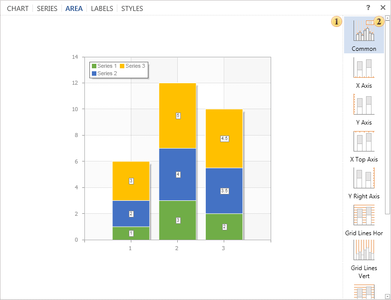

## Tab Area

The **Area** is a space that includes the basic chart items: rendered data series, axes, chart title and legend. The management of this space is carried out on the tab **Area**, in the editor **Diagram**.

 The panel **Preview**. This panel displays the chart and immediately previews changes made in real time.

 The list of parameters groups in the tab Area:

* The group **Common**. The group contains settings such as rotation, horizontal, vertical display, border color etc.

* The group **X Axis**. The group contains settings for the X axis.

* The group **Y Axis**. The group contains settings for the Y axis.

* The group **X Top Axis**. The group contains settings for the X top axis .

* The group **Right Y-Axis**. The group contains settings for the right Y axis.

* The group **Grid Lines Hor**. The group contains settings for horizontal lines.

* The group **Grid Lines Vert**. The group contains settings for vertical lines.

* The group **Grid Lines Hor Right**. The group contains settings for right horizontal lines.

* The group **Interlacing Hor**. The group contains settings of alternation of horizontal cells in the chart area.

* The group **Interlacing Vert**. The group contains settings of alternation of vertical cells in the chart area.
