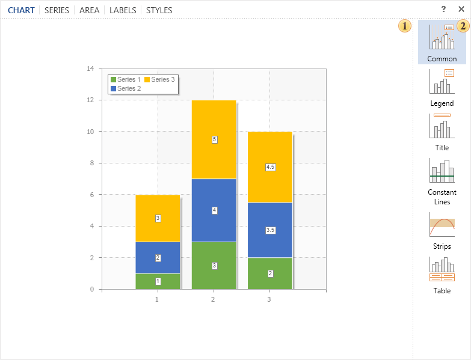
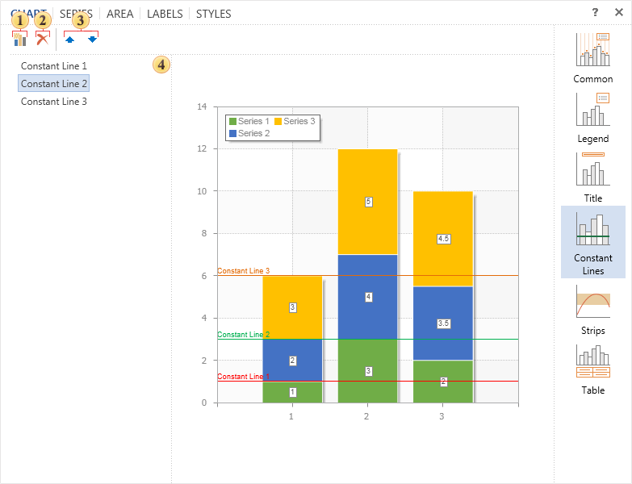

## Tab Chart

The tab **Chart** defines the parameters relating to the diagrams. These parameters are grouped depending on the selected group on the property panel.

 The **Preview window**. This panel displays the chart and immediately previews changes made in real time.

 All chart parameters are grouped. A list of these groups is represented on this panel. When a group is selected, the Properties panel will display the parameters of the selected group:

  * The group **Common**. Contains common settings such as a data source for the chart, the vertical/horizontal alignment, rotation angle and others.

  * The group **Legend**. Contains settings for the legend such as enabling/disabling it, alignment options, direction, etc.

  * The group **Title**. Contains settings for the title of the chart such as text, alignment options, etc.

  * The group **Constant Line**. Contains settings for constant lines. Moreover, in this parameter group involves adding a constant line in the chart.

  * The group **Strips**. Contains settings to control strips in charts. You can add a new strip here.

  * The group **Table**. Contains settings to display values ​as a table.

It should be noted that in some groups you can add elements to the chart. In this tab, this note concerns groups **Constant Lines** and **Strips**.

 The button is used to add the constant line.

 The button is used to erase the selected line.

 The buttons move the selected item in the list on the panel .

 The panel with the list of items.
