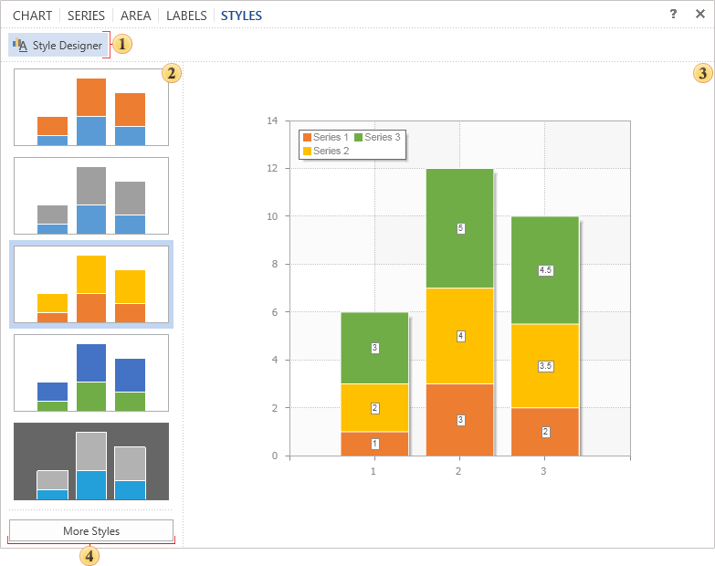

## Tab Styles

You can completely change the design of charts, ranging from basic colors and ending with shadows, borders, and so on. You can do this in the tab **Styles**.

 The button is used to call the style designer. In the designer, you can create a style for the chart and the collection of styles for other components.

 In this panel you can see the list of styles that are available by default.

 The panel **Preview**. This panel displays the chart and immediately previews changes made in real time.

 The button **More Styles**. When you click it you will see the list of styles available by default.

> **Information**
>
> If the **AllowApplyStyle** is enabled then the style will be applied. If you disable the **AllowApplyStyle** then the parameters of series will be considered.
