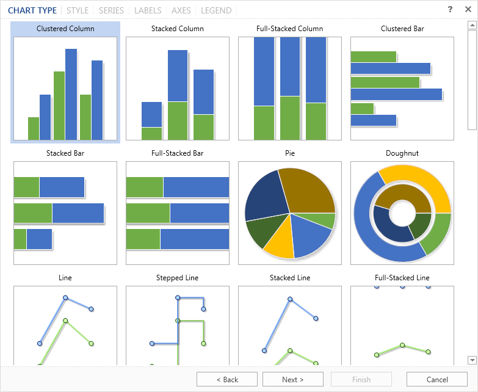
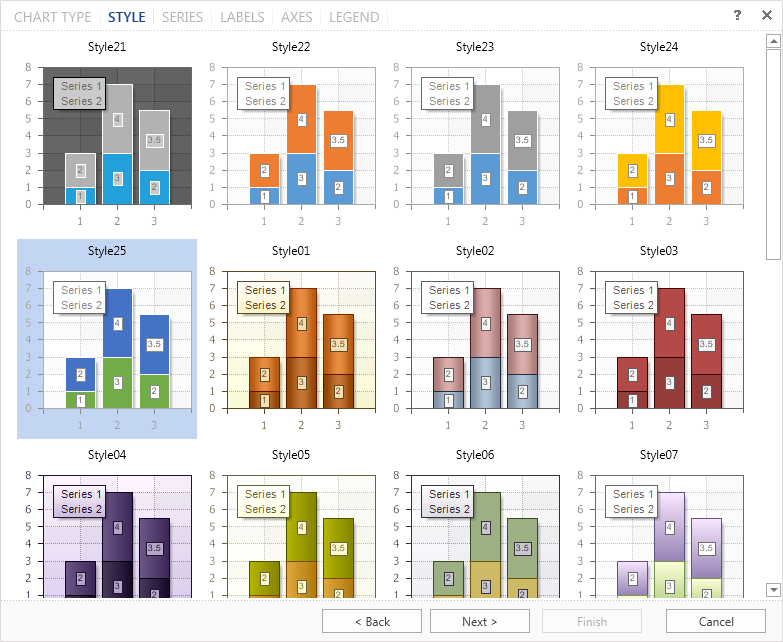
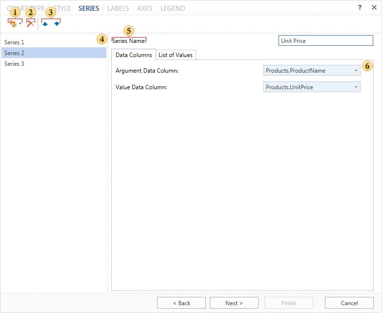
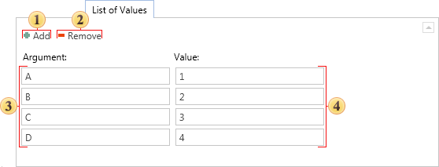
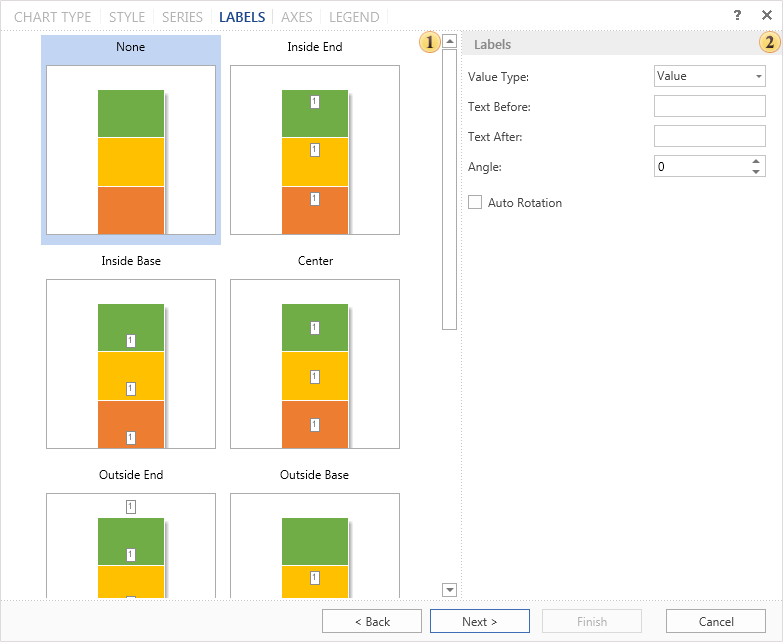
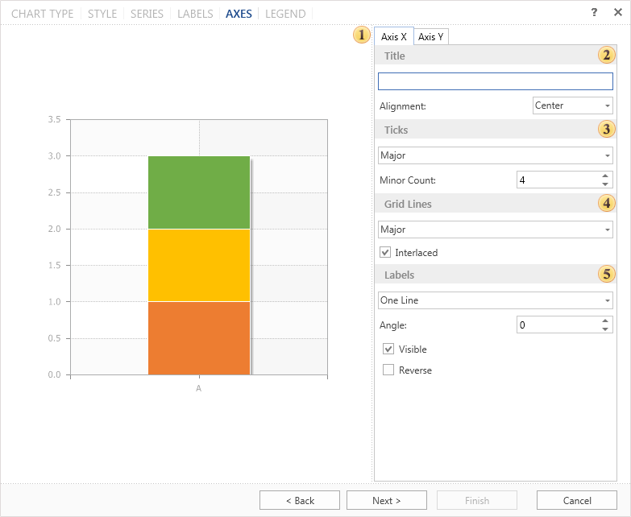
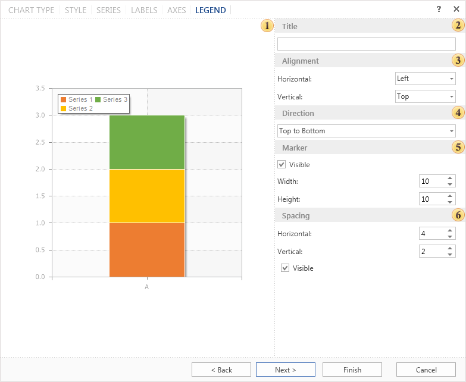

## Wizard

The Chart wizard provides an opportunity to create a chart in a few simple steps. To start the wizard, you should the button Chart Wizard in the chart editor. The wizard provides a step-by-step procedure to create a chart. By default, the first type (Clustered Column) is selected in the list.

> **Information**
>
> In order to proceed to the next step, press the button **Next**. You should remember that you can always return to the previous step by clicking the button **Back**.

The chart component contains a collection of preset styles for the chart. Select one of them to create a chart. By default, the first style in the list is selected.

In the next step, you need to create a series of charts and specify their values.

 Clicking on this button a list of series opens. Depending on the particular type of chart, the list will have different types of series. To add a series to a chart you should select it in the list.

 Deletes the selected series of a chart.

 The buttons are used to move the selected number of series in the list of charts.

 This panel displays a list of chart series.

 In the field of this this option you can change the name of the series. By default, all series have the name as Series+"number".

 In this panel you can set chart arguments and values. This panel has two tabs:

* The tab **Data Columns** ​you must specify the data columns for arguments and values. For example, the column of arguments contains entries A, B, C. The values column ​​will contain entries: 23, 43, 56. In this case, the argument A will match the value 23, the argument B will match the value 43, and the argument C - the value 56.

* Besides data columns you can manually set the arguments and values. You can do this in the tab **List of Values**.

 Add new block that consists of fields Argument and Value. You should know that in the added block the specified value will correspond to the argument in this block.

 Remove the last inserted block of fields Value and Argument.

 The list of arguments fields, i.e. in these fields arguments of a chart are specified. For example, the arguments A, B, C, D.

 The list of values fields, i.e. in these fields the values ​​of the chart are shown. For example, the values ​​1, 2, 3, 4.

> **Information**
>
> It should be noted that for rendering the chart there must be at least one values, i.e. the value is required to be specified. Arguments, if they are not specified, they will be automatically created.

On the next step, it is necessary to define the look of labels in the chart. By default, labels are disabled.

 The list of labels for the chart, with examples of their placing on this type of a chart.

 Parameters of labels, their angle, the text before the header text after the header, etc.

> **Information**
>
> You should know that when you create a chart manually, i.e. without using the wizard, you can specify label look as the entire chart and its our look for each row of the label. When you create a chart using the wizard, you can only define the general form of signatures for the whole diagram, i.e. one type for all series of the chart.

On the next step, it is necessary to define axes settings.

 The panel **Preview**.

The most important settings are displayed on the axes. Moreover, this panel has tabs axis X and axis Y.

 The parameter **Title**. This group of settings specifies the text of the axis title and its alignment.

 The parameter **Ticks**. It is determined by the number of intermediate ticks and display mode - without labels, only the main, and all labels.

 The group **Grid Lines**. This group defines the parameters of the grid line.

 The group **Labels**. In this group you can specify the parameters of axis titles such as on/off, reverse, etc.

In the last step you need to define parameters of the chart legend. Legend is an area that displays the symbols of different data series in the chart.

 The panel **Preview**.

 The group **Title**. Here you can specify the title for the legend.

 The group **Alignment**. Legend can be located in different places in the chart. In this group you can setup the vertical and horizontal alignment of the legend in the chart.

 The group **Direction**. Entries in the legend can be placed in different directions. Here you can indicate the direction in the legend in this group.

 The group **Marker**. The marker is an icon that helps you to visually recognize a series of charts. The number of markers corresponding to the number of rows. Setting markers is performed in this group of parameters.

 The group **Spacing**. Increasing or decreasing the vertical and horizontal indentation in the legend is carried out with the help of these parameters. Also, in this group there is a parameter Visible. If this option is enabled the legend is displayed. If not - the legend is not displayed.

Click the button **Finish** and the chart will be created.
