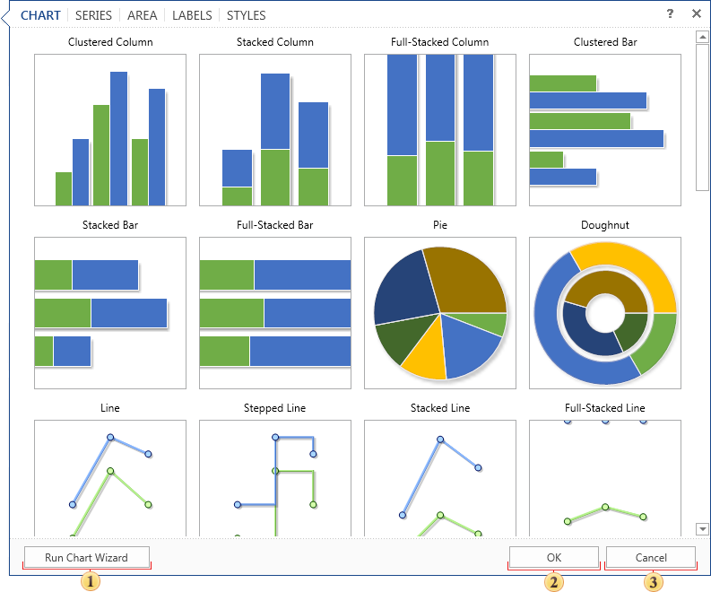

## Charts Editor

When you add the component Chart in the report template, the chart editor is called. This editor is used to create the chart: defining the types of rows, data sources, styles, and other settings. A chart can be created using the wizard or manually. Below is a diagram editor.

 The button [Run Chart Wizard](Wizard.md).

 When you press this button, a chart of a certain type with the specified parameters is created.

 Pressing this button cancels the creation of a chart but the component remains is the report template.

As can be seen from the picture above, the chart editor contains the following tabs:

* [Chart](Tab_Chart.md). Defined the Chart type;

* [Series](Tab_Series.md). Defines the parameters of the series;

* [Area](Tab_Area.md). Sets areas with axes;

* [Labels](Tab_Labels.md). Sets chart labels;

* [Styles](Tab_Styles.md). Sets the style for the chart.
