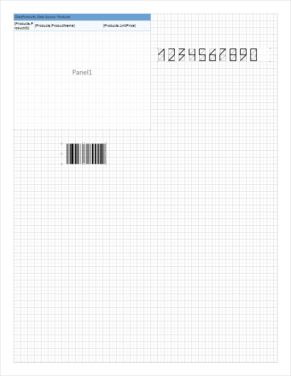
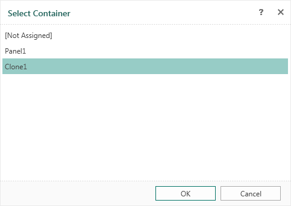
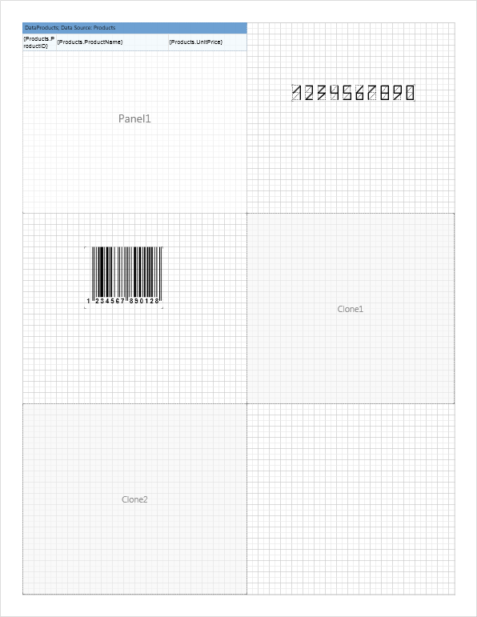
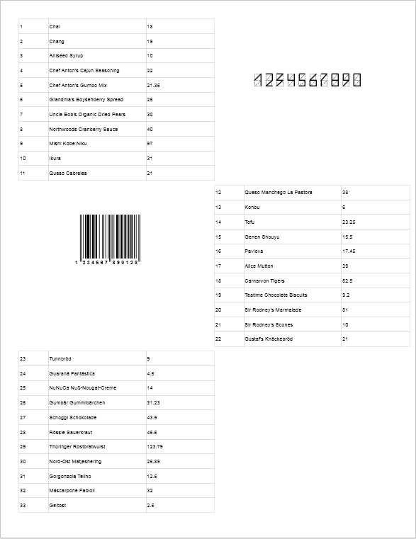

## Clone

Components of Stimulsoft Reports include a unique one - **Clone**. This component is designed to continue a report in a certain location of a report.

> **Information**
>
> The **Clone** component can only work with the Panel component.

Consider the process of using the clone. Suppose you need to display a list of products in different parts of the report page. To do this, put the **Panel** component (call it **Panel1**) somewhere in the report and place in it a **DataBand** with a list of products.

On the right side of the panel and below it you need to display any other component (image, text, chart etc.). In the example above we put the ZIP code on the right and the bar-code below. In the rendered report the list will be interrupted within the borders of the panel. The ZIP code will be on the right and the bar-code below. The list will be continuing to output on the next page. Place the **Clone** component (call it **Clone1**) to continue the list on this page, minimizing the empty space and specify the component **Panel1** as a source. Selecting the source for the **Clone** component is carried out in the **Select Container** form, which will be opened when adding of a clone in a report template or when editing the clone.

It is also possible to arrange one more **Clone** components **Clone2**, but define **Clone1** as a source.

When rendering a report, a list of products will be displayed in the component Panel1. After the panel is filled the list of products will be output in Clone1, and then in Clone2. If not all data from the source will be displayed in the report, the rendering continues on the next report page, in the same sequence (Panel1 - Clone1 - Clone2). At the same time, the ZIP code and bar-code will be output. The picture below shows a page of the rendered report.

> **Information**
>
> Panel components and their clones are output the order of placement of components on a page.
