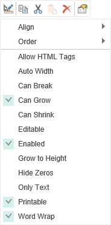
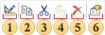
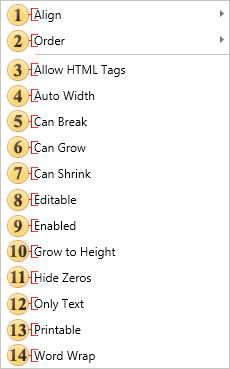
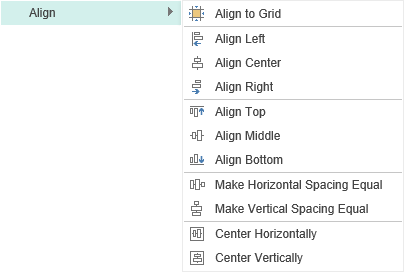
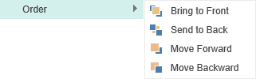

## Context Menu

The **Context Menu** is a menu in a graphical user interface that appears upon user interaction (a right mouse click). A context menu offers a set of choices that are available in the current state of the component.

As can be seen from the picture, the context menu has a range of instruments and a list of commands. First, we consider the toolbar.

 The command **Design...** invokes the editor of a selected component. For example, if it is a text component then the **Text Editor** will be called.

 The **Copy** command copies the selected component to the clipboard.

 The command **Cut** cuts the selected component to the clipboard.

 The command **Paste** pastes the copied or cut component from the clipboard.

 The command **Delete** deletes the selected component.

 The command **Property**. By pressing this button the properties panel of the selected component will become active.

In addition to the range of instruments the context menu also contains commands and some properties of the component:

 **Align**. This item contains a submenu that contains commands to align components. For example, align to grid.

 The group **Order**. Using these commands you can determine the position of the selected component. For example, a component can be placed in the foreground.

> **Information**
>
> With the simultaneous selection of two or more components, the **Size** command appears the context menu. This command contains a sub-menu, where you can define the parameters of the same size for all selected components. The sample size will be the size of the component from what the selection started. If you select all the components on the page, choose **Select All** in the context menu, or use the shortcuts **Ctrl + A**, then the size of the prototype for all the components will be the size of the component, which is located at a higher level above the rest of the components in the report tree on this level. Viewing the report tree can be done on the Report Tree panel.

The component properties below are displayed depending on the type of the selected component. For example, a list of values for the text component:

 In order to use HTML tags in the text, it is necessary to enable this option.

 The **AutoWidth** property provides the ability to automatically change the width of the text component, depending on the width of the text.

 **Can Break**. This property should be enabled if breaking a component is allowed.

 **Can Grow**. If the **Can Grow** property is set to true the component can automatically increase its size if the information contained within it does not fit in the space available. If it is set to false the information will be cropped to the component size

 **Can Shrink**. If the **Can Shrink** property is set to true the component can automatically reduce its size so that it fits exactly to the size of the text or image being displayed.  If it is set to false the component remains the same size leaving unused space around the information it contains

 **Editable**. In order to edit the text component in the report viewer, using the Editor tool, you should enable this property.

 **Enabled**. If you want to disable the component you should disable the property (uncheck it).

 **Grow to Height**. If you set the **Grow to Height** property to true all components that do not change their size will have their bottom borders bound to the bottom border of the container.

 **Hide Zeros**. In order not to display zero values​​, you should enable this property. If the property is enabled, the zero values ​​are not displayed.

 **Only Text**. The text component can contain expressions, text, features, HTML tags and more. If you enable this option, then the contents of the component will be processed as text.

 **Printable**. If you want the selected component be present in the report when printing, then you should enable this property. If this property is disabled, the component will be present in a report, but will be absent in the report when printing.

 **Word Wrap**. If the **WordWrap** property is set to false, then the text is output in one line, and if it does not fit in one line it will be cut.
