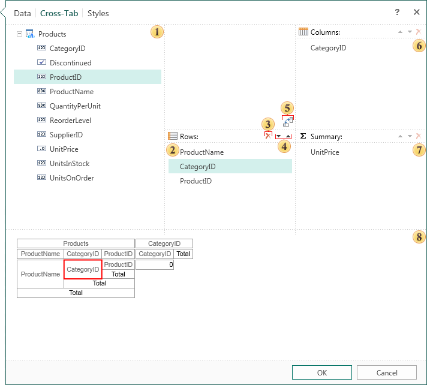

## Cross-Tab Tab

The Cross-Tab tab contains options to define the structure of a cross-tab component, the column indicates the data for the rows, columns, summary cells.

 The data source that will be used to create a cross-table.

 A list of data columns which will form a cross-tab.

 The button deletes the selected item from fields - Rows, Columns, Summary.

 If to add more than one item to the cross-tab fields (rows, columns, summary), the button will be available to move the selected item in the list.

 The reverse button between the columns and rows. Clicking the button changes the contents of the line to the contents of the column.

 The list of data columns, which will form the cross-tab columns.

 The list of data columns, which will form the totals of a cross-tab.

 This panel shows the structure of a cross-tab.
