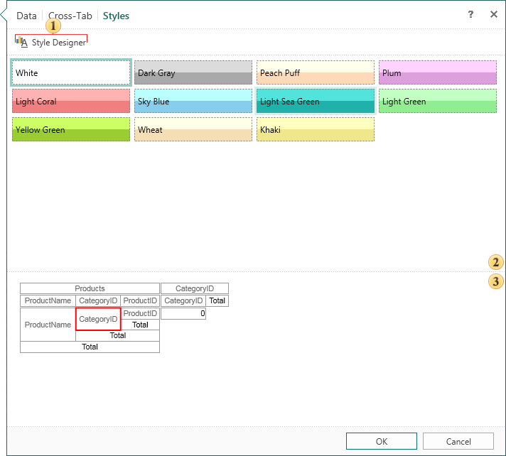

## Styles Tab

The final stage of the creating a cross-tab is to define its style.

 The button calls the style designer.

 The list of preset styles available for cross-table. If you need a different style, you should call a designer to create a new style. In order to select the desired style, simply select it. At the same time the preview panel will display the structure of a cross-tab with the applied style.

 The preview panel to see the structure a cross-tab. A red box around the cell indicates that the cell is selected.
