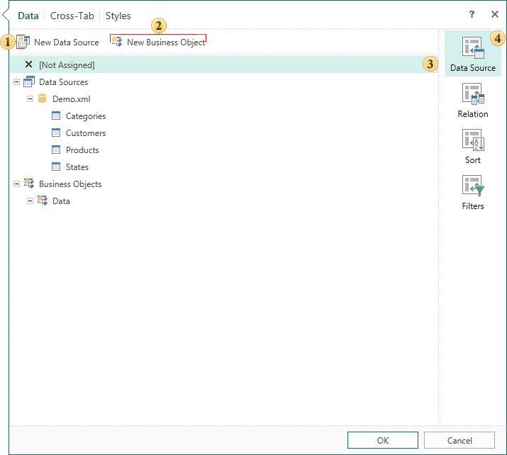

## Cross-Tab Editor

When creating a cross-tab component or when editing this component, a special editor will be called. The editor has **Data**, [Cross-Tab](Cross_Tab.md), and [Styles](Styles.md) tabs which contain settings of the **Cross-Tab**. In addition, settings and parameters are grouped in tabs.

 The button **New Data Source**. Clicking this button will open a window to create a new data source.

 The button **New Business Object**. Clicking this button will open a window to create a new business object.

 This field displays the settings and parameters.

 The list of parameter groups can be found on this tab.

* **Data Source**

In this group you can select data source for the cross-tab. In addition, there is a button to create a window to call the data source and the new business object.

* **Relation**

In this group, the connection between the selected sources is selected. There is also a new button New Relation to call the windows to create a connection.

* **Sort**

In this group you can specify sorting parameters and its direction.

* **Filters**

In this group you can specify filtering parameters, add a new filter, set filtering conditions.
