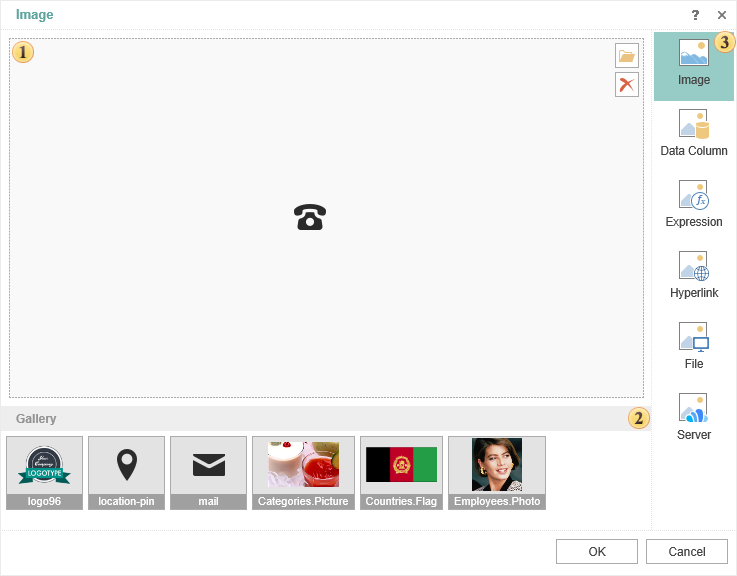

## Image

Sometimes you need to add an image to the report. It can be photos of goods, workers, statistics, etc. Images can be added from different sources. The component **Image** is used for this purpose. The Image component can be placed on a report page, data band, header, footer band etc.). When you put this component on the report page the form **Image** will be called.

 The panel displays the uploaded image.

  * The button **Open**. Pressing this button will call the dialog box where you can select an image to upload.

  * The button **Delete**. Deletes an image.

 The **Image** **Gallery** is a list of images from the data dictionary items: data sources, variables, resources.

 The list of sources from where the image can be uploaded.

As can be seen from the figure above, the images can be downloaded from various sources. Consider out in more detail.

* The source **Image**

In this case, you must click **Open** and select the image. This is the upload an image from a local source.

* The source **Data Column**

The image may be contained in the data table, for example, a separate column of data with images. With this type of source, you must select a data column from which the image will be extracted.

* The source **Expression**

Loading pictures from the expression. In this case the expression will be specified. For example, the image may be contained in a variable. Therefore, it is enough to specify the expression, that is a reference to the variable from which the image is taken.

* The source **Hyperlink**

The image can be uploaded from a URL. You can also specify a link to the report resource by the next template **resource://nameimage**.

* The source **File**

The image can be retrieved from a file that will be uploaded from a local source. With this type of source, you need to press the 

 button and select a file.

* The source **Cloud**

If the image will be attached to the report, they will be displayed in this source.
