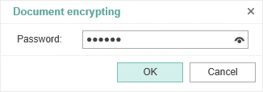
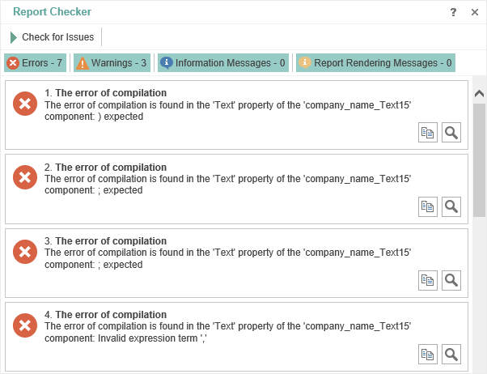

## Info

This menu contains commands for working with the report template:

* **Report Options**

 Parameters which affect on report rendering

* Convert **Nulls**. If the flag is checked, all **Null** values will be converted to the default values for the type. For example, you must find the arithmetic average in the prices of the product. If **Null** is not converted, the result is not correct, i.e. these values will not be considered. Therefore, you should enable this option, and then all **Null** will be converted to 0. In this case, the result of calculating the mean value will be true.

* **Number of Passes**. In most cases, one pass in the report rendering is sufficient, but sometimes there are cases when you need double pass. Consider an example. Suppose, on the last page of the report you should output some information. Before rendering of the full report, in fact we know that the account will be the last. Therefore, in this case, it is better to use a double pass when rendering a report, i.e. in the first pass the number of pages in the report will be determined and during the second pass the information on the last page will be added.

 Defining units in the report. For example, if you select centimeters then all the calculations in the report will be made in centimeters.

* **Protect Report**

The report template can be password protected. To do this, select the Security item of the report, specify the password and click the Ok button:

In this case, the report will be packed and encrypted. To open the report in the report designer, you will need to specify a password.

* **Check for Issues**

In order to check the report for errors you should use the **Report Checker**. The Report Checker will analyze the report, resulting in an **errors**, **warnings**, **information messages**, **report rendering messages** in this report. The picture below shows the Report Checker:

Click the **Check for Issues** button  in the report checker to verify the report on problems.
