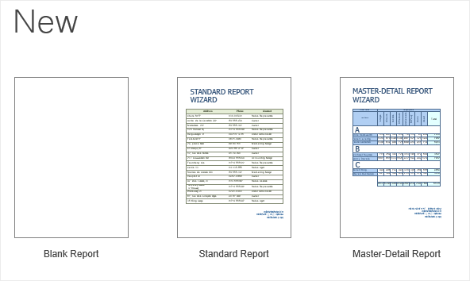
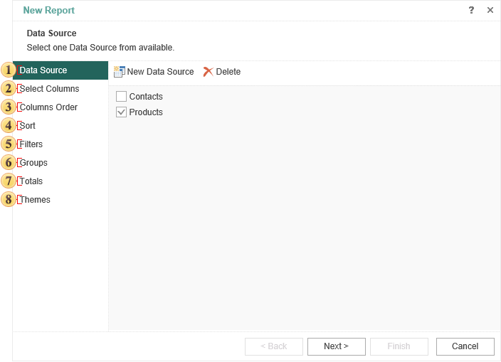
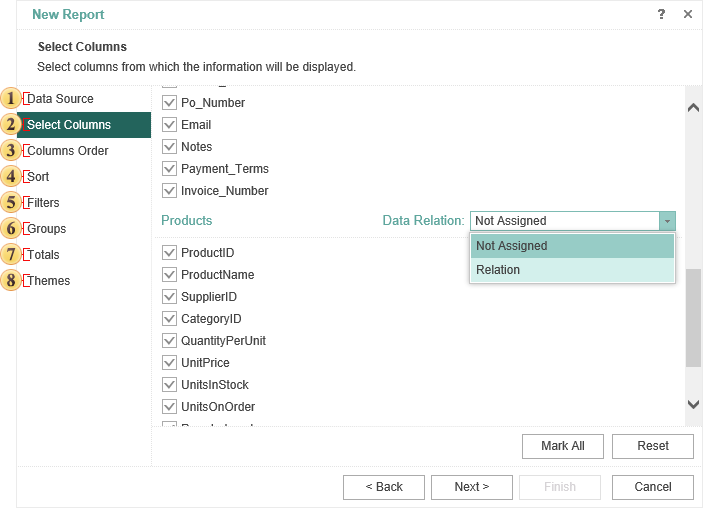

## New

> **YouTube**
>
> Watch our video tutorials how to create report with use [Standard Wizard](https://www.youtube.com/watch?v=jUlfB0FarBI&list=PL-72PPAq-3SUmzS9elmeG-Uo3cRyJWmn0&index=20) and [Master-Detail Wizard](https://www.youtube.com/watch?v=Y2H-FDMXOxo&list=PL-72PPAq-3SUmzS9elmeG-Uo3cRyJWmn0&index=19). Subscribe to the [Stimulsoft channel](https://www.youtube.com/user/StimulsoftVideos) and be the first who watches new video tutorials. Leave your questions and suggestions in the comments to the video.

This menu contains commands for creating report template:

A report can be created blank or you can create it using one of the wizards for building reports.

When you create a report using the **Standard Report** wizard, the report will contain one **Data Band** or one **Data Table**:

 Select the data source on which a report will be created. This is a mandatory step.

 Select data columns to be output in a report. This is a mandatory step.

 Specify the order of placing the columns on the **Data Band**. The order of the columns from top to bottom corresponds to the order of the columns in the report from left to right. Changing the order in the report wizard is possible with the help of two buttons on the control panel of this step.

 Sort data if needed.

 Sometimes you need to show not the whole list of data but a specific range of data. For example, display the products cost from 40 to 200 dollars. In this case, the report is used to filter the data. Conditions of filtering are determined at this stage.

 The report, which has too large volume of data, can be easier to perceive, if to make grouping of data. For example, if the report contains a list of products, they can be grouped by the first letter of the product name. Parameters are determined by grouping in this step.

 Here you can define a function to calculate the totals for any of the columns of the selected data source.

 In this step, you can choose the style of the report and apply it to it.

Creating a master-detail report using the wizard includes 8 steps. Not all of them are mandatory.

  Select the data source on which a report will be created. This is a mandatory step.

> **Information**
>
> You should understand that the Master-Detail Report at least two sources, one of which is the master, and the second is detail. At the same time, the relation between these sources should be organized.

 Select data columns to be output in a report. This is a mandatory step. Also, on this step, select the relation between data sources.

 Specify the order of placing the columns on the Data Band. The order of the columns from top to bottom corresponds to the order of the columns in the report from left to right. Changing the order in the report wizard is possible with the help of two buttons on the control panel of this step.

 Sort data if needed. Sorting can be set separately as a Master and Detail.

 Sometimes you need to show not the whole list of data but a specific range of data. For example, display the products cost from 40 to 200 dollars. In this case, the report is used to filter the data. Conditions of filtering are determined at this stage. Filtering can be set separately as a Master and Detail.

> **Information**
>
> If the Master entry will not fit in the filter conditions, i.e. data is output for printing, in this case, all its subordinate entries will not be printed.

 The report, which has too large volume of data, can be easier to perceive, if to make grouping of data. For example, if the report contains a list of products, they can be grouped by the first letter of the product name. Parameters are determined by grouping in this step.

 Here you can define a function to calculate the totals for any of the columns of the selected data source.

 In this step, you can choose the style of the report and apply it to it.
