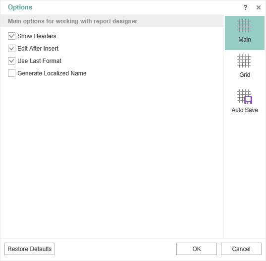
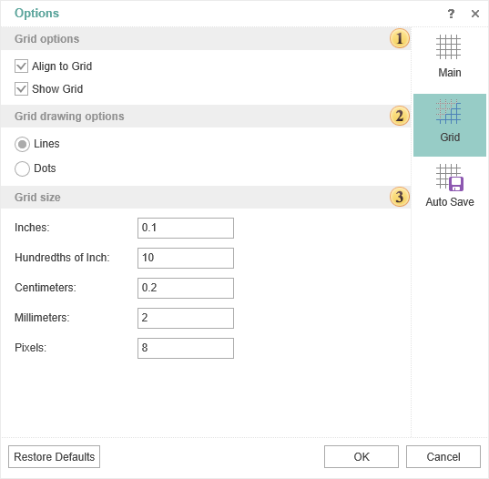
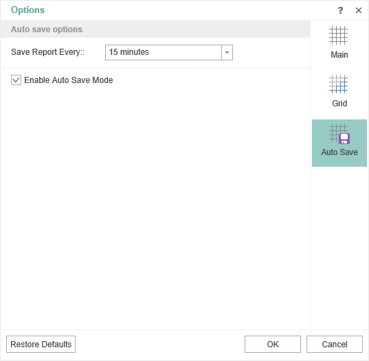

## Options

In the **Options** menu you can find advanced settings of the report designer. These settings are located on the following tabs:

* The **Main** tab contains the basic settings. For example, headers, rules, etc. Select the check box to turn on the option you want.

* The **Grid** tab contains grid settings in the report designer. For example, on this tab, you can turn on the grid, alignment, the way to draw the grid (line or point), set the unit for the grid.

 The commands to manage the grid:

* The **Align to Grid** parameter provides an opportunity to align components by the grid.

* The **Show Grid** parameter provides the ability to enable or disable the grid in the report designer.

 The grid drawing method. **Lines** or **Dots**.

 The grid settings in the various units.

* In the **Auto Save** tab specify settings to automatically save changes:

To enable the **Auto Save mode**, you should check the box for the **Enable Auto Save Mode parameter**, and to specify the interval through which the auto save will occur.
