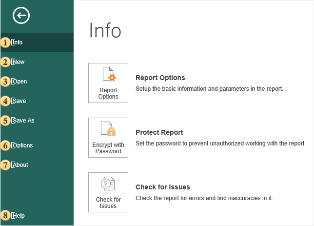
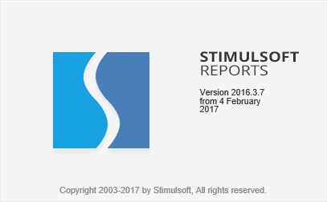

## File

In the **File** menu the key commands for working with reports in Report Designer are present:

 The [Info](Info.md) menu item contains the configuration commands, security and report checker.

 The [New](New.md) menu item contains a list of commands to create a new report.

 The **Open** command provides the ability to load the report into the report designer:

  * The report can be opened from the server space;

  * The report can be opened from the local storage;

  * There is also a tab with a list of reports that have been previously uploaded to the report designer.

 The **Save** command provides the ability to save changes to the current report.

 The **Save As** command provides the ability to save changes to the current report and specify the folder to save this report:

  * The report can be saved in the server space;

  * The report can be saved by means of a browser in the local storage.

 The [Options](Options.md) menu command defines the configuration of the report designer.

 The command to call the **About** menu provides information about the product, its version, as well as the date of the assembly:

 The command to go to the documentation of the **Stimulsoft Reports.Server**. The document will be opened in a new browser tab.
