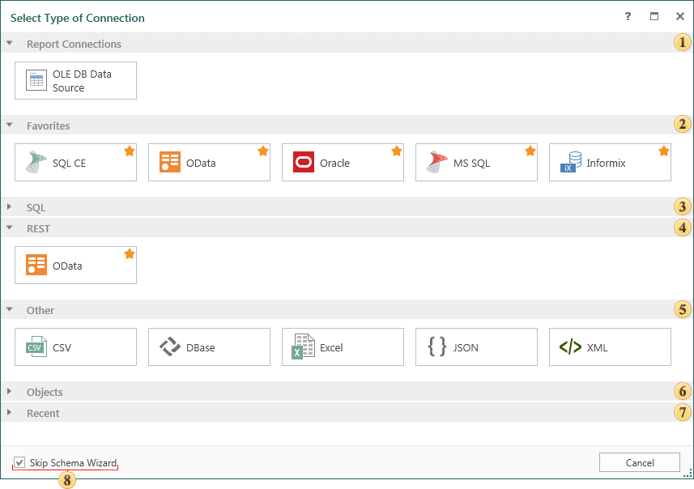
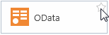
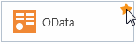
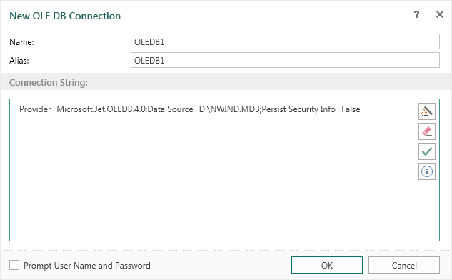
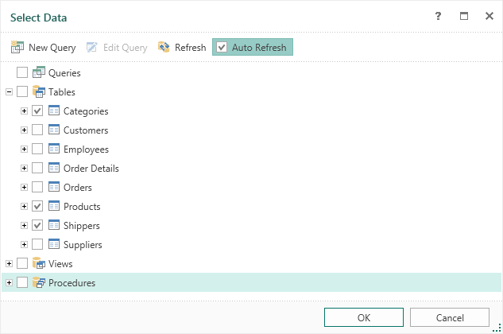
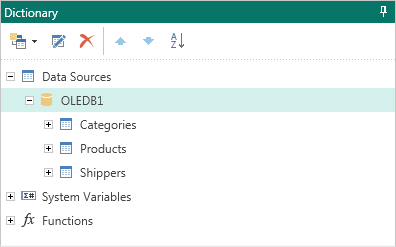

## New Data Source

> **YouTube**
>
> Watch our video tutorials how to [Create Data Source](https://www.youtube.com/watch?v=JkCuT0Rfhjo&index=4&list=PL-72PPAq-3SVTDRG4LI2jpIHk5KduEMS1). Subscribe to the [Stimulsoft channel](https://www.youtube.com/user/StimulsoftVideos) and be the first who watches new video tutorials. Leave your questions and suggestions in the comments to the video.

The report is a set of structured data. The entire structure of the report is a report template. When you create a report template there must be a description of the data. You can create a description of the data in the following ways:

* The Data Source item is created on the server, the Import Data command is executed. Then the created data source is attached to the Report item. In this case, when the report is loaded to the report designer, the description of the attached data source will be created in the data dictionary. Based on this description, you can create report templates. When rendering a report, the report server will extract the data from the source and implement their transfer to the report.

> **Information**
>
> The description of data does not contain the actual data. Filling the data is carried out at the time of the report creation process.

* The second method is to create a description of the data from the report designer. To do this, go to the **Dictionary** panel and, in the New Item menu, select the **New Data Source** command.

In the menu of creating a data source, all types of connection are grouped:

 The **Connection** group includes already set connections to data stores. If no connection is set, this group will not be displayed.

 The **Favorites** group lists the types of connections that have been marked by the user. In other words, the user can create a list of connections, noting them with stars. To do this, move the cursor to the top right corner of the connection and click the left mouse button (if you are using the touch interface just click the pointer input). If the star becomes orange, the connection is added to the list of favorites. In order to remove the connection from the list of favorites, you should click on the "burning" star.

On the left image the star is not checked, so the connection is not selected, and the right image shows that the connection is favorite. If no one connection is highlighted with the star, this group will not be displayed.

 This group contains a list of all the connections that support the SQL connection string.

 This group contains data sources to connect to the data store using the REST protocol.

 The **Other** group is placed commands to create connections to the data stores such as XML, Excel, JSON, CSV, Dbase.

 To create a connection to databases containing objects you should refer to this group. For example, for passing business objects from the storage to the report.

 This group contains previously created connections. In other words, if a connection to the data store was ever created, but is not available in the current report, the connection will be placed in this group.

 The **Skip Schema Wizard** parameter. When you are creating a data source you can retrieve data from the storage in the following ways:

* Get the data schema. In this case, you will see a hierarchical list of data in the form of tables, views, stored procedures, etc. The user should select the sources with flags. Thus, if there is huge amount of data in the store, it is preferable to use the second method described below;

* Generate a request for retrieving data.

Determine the method of obtaining the data is possible using the **Skip Schema Wizard** parameter. If you need to get data schema, you should uncheck this option of the parameter. If you need to go to the creation of a query you should check this option of the parameter. You should remember that you can go to the creation of the query by clicking the **New Query** button from the form of retrieving the data schema.

> **Information**
>
> Ignore getting data scheme applies only to data sources that are part of a group of SQL data sources.

Now look at an example of creating a new data source. It is worth noting that before creating a data source you must have a created connection. If there is no connection, then go to the **Dictionary**, select **New Data Source** in the menu item **New Item**, and select the type of connection, for example, OLE DB. The form of the creation of the connection will be open:

You should indicate the name of the connection, its alias, as well as the connection string. Here are the buttons to call the query builder, clear the connection, check the connection and the connection string template button (for OLE DB templates is as follows - *Provider=SQLOLEDB.1; Integrated Security=SSPI; Persist Security Info=False; Initial Catalog=myDataBase; Data Source=myServerAddress*). To verify the connection string, press the Test button. However, if the connection string does not contain errors, the user will be shown a window with the Connection was successful. If the connection string contains an error, the user will be shown a window with the text of the error that the database server returned in response to the attempt to create the connection.

After clicking Ok, a new connection will be created and you will see a form of retrieving data. Depending on the type of connection and on the value of the **Skip Schema Wizard** parameter, the form of retrieving data will be open. In our example, the flag of the **Skip Schema Wizard** was unchecked. Then data retrieval is carried out by the scheme. To get a list of tables from the database, it is necessary to click the **Refresh** button in this window. You can also enable/disable the Auto Refresh mode setting/clearing the flag. If the flag is checked, the wizard will automatically update the list of data tables. The list in this window contains tabs, which are arranged in a hierarchical form. The main tab represents a category (for example, Queries, Tables, Views, Procedures).

Select data table to create a new data source. It is also possible to exclude a column of data tables from the data source of the future. For this purpose, it is necessary to reveal the selected table and uncheck the box next to the name of the column that you want to exclude. By default, if the data table is selected, then all columns in this table are flagged, i.e. will be added to a new data source. Each selected data table will be a single source of data, ie, one table - one source. The picture below shows the **Select Data** window to the selected data tables, and columns of selected data.

After clicking **Ok**, the data sources **Categories**, **Products** and **Shippers** will be created. The picture below shows the created data sources in the **Dictionary**.

Now, on the basis of these data descriptions you can create report templates.
