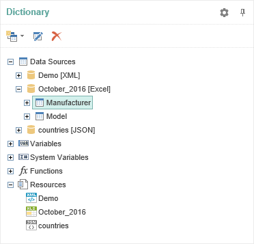
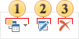
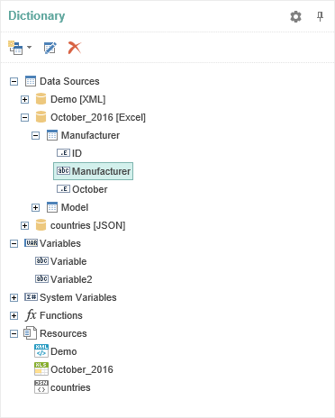
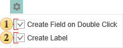

## Dictionary

The panel **Dictionary** displays attached data, available data sources, system variables and functions. In addition, the dictionary can create a new connection and connect data sources to set up new connections between data sources.

**The panel** **Dictionary** **consists of** the **Dictionary ToolBar**, **Data Tree**, and **Dictionary Setting Panel****.**

* The basic elements to control data dictionary can be found on the control panel.

 The menu **New Item**. In this menu the basic commands to create new elements in the data dictionary are placed - new connection, new data source,new variable, business objects.

 The button **Edit** provides an opportunity to change any element, which can be edited.

 Using the button **Delete** one can delete any item in the data dictionary.

* The **Data Tree** **represents a list of all the data dictionary, which are displayed in a tree.**

* The panel **Panel Setting Dictionary** contains controls that provide an opportunity to change auxiliary parameters of the data dictionary.

  If the option **Create Field on Double Click** is enabled, then when double clicking the data column data in the report data dictionary, the report template in the DataBand will create a text component with reference to this data column.

 The parameter **Create Label** is used to create two text components (one with the signature, the a second with reference to the data column) when dragging a data column into the report. If this option is disabled, then, when dragging, only one text component with reference to a data column will be created.
