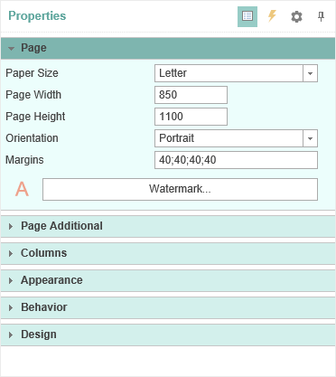
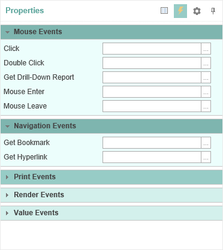
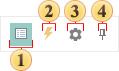

## Properties

The **Properties Panel** displays all the properties of the selected component and its events. The picture below shows the Properties Panel, showing the properties of the component (left) and the events of the component (right).

The **Properties Panel** includes: the **Drop-Down List of Components**, **Properties Toolbar**, **Properties Tab or Events Tab**, and **Description Panel**. Consider these components in more detail.

* **Properties Toolbar** is used to control the Properties Panel. The picture below shows the Properties Toolbar.

 The button is used to sort by category - **Categorized**. The list of properties or events are sorted by category.

 The button is used sort alphabetically - **Alphabetical**. The list of properties or events are sorted in alphabetical order from A to Z (from A to Z).

 The button **Localize Property Grid**. If it is disabled, then the properties panel will be displayed with the default locale.

 The Pin button.

* The **Properties Tab** or **Events** is a table with two columns. The first column shows the name of a property or event, the second - values of this property or event. The number of rows depends on the number of properties or events, as one property or event takes one line. In the **Properties** panel of the context menu there is the **Localize Property Grid** command. If this command is enabled, the the Properties panel will be translated. If this command is disabled, the names of the properties, events, values and a description of the Properties panel will be in English.
