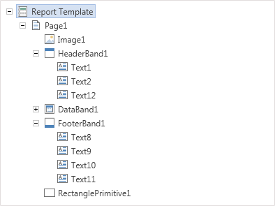

## Report Tree

The panel **Report Tree** panel shows the hierarchy of the report, i.e. represents all the components of the report in the form of a tree. In addition, if an event handler is added to the component, it will also be displayed in the hierarchy of the report. The picture below shows an example of the panel **Report Tree**.

As can be seen on the picture above, hierarchy is represented on the principle of "nesting". The panel provides the ability to visually identify the submission of a "component to a component".
