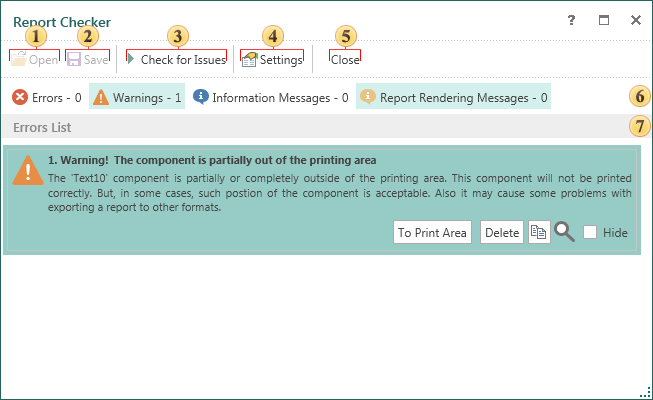
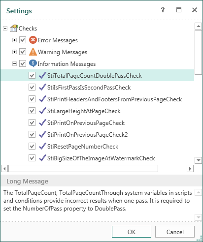

## Report Checker

In order to check the report for errors you should use the **Report Checker**. The Report Checker will analyze the report, resulting in an error message, comments, or inaccuracies found in this report. The picture below shows the Report Checker:

 The button **Open**. Clicking this button, the user will see a dialog box to select a previously saved report and loading it to the Report Checker.

 The button **Save** saves changes in the report, that was opened in the Report Checker.

 The button **Check for Issues** starts the process of checking the report.

 The button **Settings** opens the window of settings of the Report Checker. The picture below shows the Settings window:

In this window, you can mark messages and warnings you want notifications to be displayed.

 The **Close** button closes the window of the Report Checker.

 The panel for showing messages.

 The panel for showing descriptions of **Errors**, **Warnings**, **Information**.
