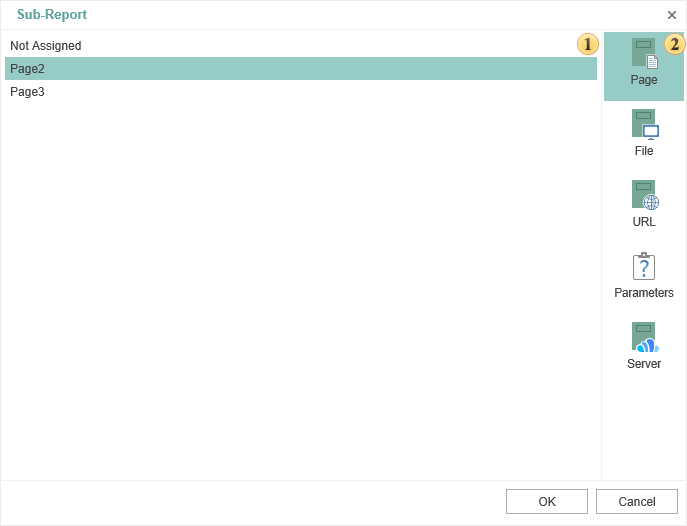
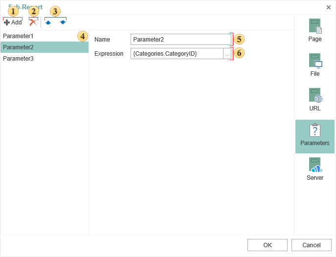

## Sub-Report

The **Sub-Report** is a report component that can be placed on a band, page, panel or any other component that can be a container for the sub-report. When placing this component, the reporting tool will add nested page into the report and bind it with the Sub-Report. When rendering a report, the reporting tool will build all sub-reports and place them in this container. On the nested page a report that has any structure can be created. Also the **Sub-Report** component can be placed on the nested page, so the nested page of the second level will be created. In other words it is possible to create complex hierarchy in a report.

 In the image above, this field displays the list of pages in the report template. You must select the page on which the sub-report will be located.

 Tabs. Each tab is a definite source of sub-reports except the tab **Parameters**.

Consider the other tabs in more detail.

* The tab **File**.

You need to press the button 

 and select a file (*.mrt). This file will be a sub-report.

* The tab **URL**

You should specify the URL to a sub-report.

* The tab **Server**.

On this tab, you should specify the report from the report server, i.e. specify a sub-report from those stored on the report server. Consider an example. A report list of products is storing on the report server. This report will be a sub-report. Also the server has a report - list of categories, which will be the master report. Therefore, you must perform the following steps:

1. Select the report **list of categories** in the item tree of the **Navigator** and click the button **Edit** on the tab **Home** or select a similar command from the context menu.
2. In the field **Attached Items** add a report list of products and click **Ok** in the edit form.
3. Load the report list of categories to the report designer by selecting the command Design Report. After the report designer is running all attached items by category will be shown in the **Dictionary**. If images are attached then the Dictionary will have the category **Images**, if reports - the category **Reports**. In this example, the report is attached. This means that the category Reports should be created and the report list of products will be in it. More precisely, a description of the report list of products with reference to the object of the report server will be present.
4. Add the **Sub-Report** to a desired location, and, on the tab Server, specify a report by products (dragging list of products from the data dictionary to the field of the sub-report editor or select it in the data dictionary and click the button  ).

**Parameters**

The relation between the master and sub-report is done by passing parameters from one to another. For example, the parameters may be used in filtering data:

* If the product should be filtered by category,  then it will pass the category **ID**.

* It is necessary to specify in the attached report (in band, cross-table, tables, etc.), a filter expression by **CategoryID**.

The picture below shows the editor **Sub-Report** on the tab **Parameters**.

 The button to add a parameter to the list of parameters.

 The button to delete the selected parameter from the list.

 Navigation buttons in the parameter list in the direction of "up and down".

 The panel with the list of the parameters.

 The name of the parameter.

 The field which indicates the expression of the parameter. The button 

 is used to add an expressions, if a function, column data, variables, etc is selected in the the data dictionary.
