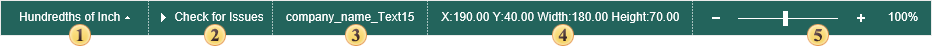
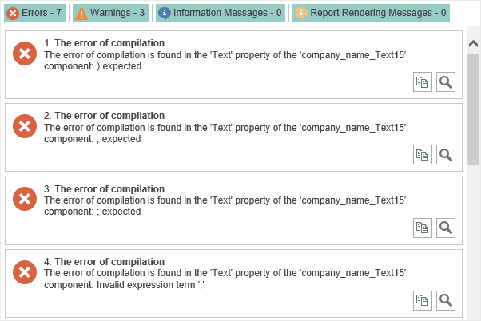

## Status Bar

The status bar is placed under the designer window. The picture below shows a status bar of the Standard UI.

The bar contains 4 sections:

 **Units**. This field shows current units in a report. It is possible to change them.

 Start Report Checker. The Report Checker will analyze the report, resulting in an **errors**, **warnings**, **information messages**, **report rendering messages** in this report:

 Name of Selected Component.

 Shows cursor coordinates on a page of a report template. (Х:0,0 ; Y:0,0) coordinates corresponds to the top left corner of a page of a report template.

 The slider to zoom reports.
