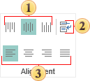

## Alignment

The group is used to align the content of components horizontally and vertically. Also it is possible to set the angle of the text rotation and control the WordWrap property.

 Align top, center vertically and bottom the content of a component.

 Used for the **WordWrap** property of the text component.

 Align left, center, right or justify the content of a component.
