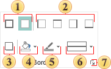
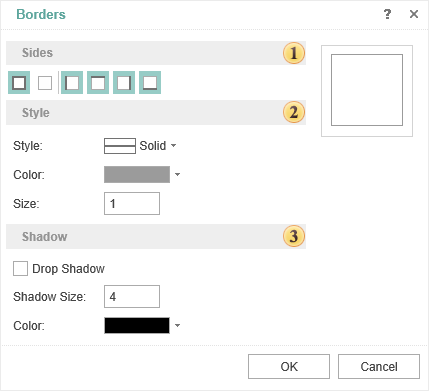

## Borders

This group contains the commands to setup border components.

 Sets or removes borders from all sides of a component.

 Sets or removes borders from each side of a component.

 Sets a border color of a component.

 Sets the shadow of a component.

 Sets a background color of a component.

 Sets a type of the border line.

 The button to call the border editor.

 Using the visual editor you can set the borders.

 In this field you can change the style of the border (e.g., solid, point, double, etc.).

 In this field you can set shadow options.

* The **Drop Shadow** parameter shows/hides the shadow of the border.

* Here you can change the size of the shadow.

* Here you can change the shadow color.
