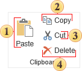

## Clipboard

This group allows working with the Clipboard of the report designer.

 Paste components from the Clipboard on the current page of a report.

 Copy the selected components on the current page to the Clipboard.

 Cut the selected components from the current page to the Clipboard.

 Delete selected components on the current page.
