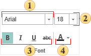

## Font

This group is used to output text with the specified font type, color etc.

 Select the font type of the text components on the current page.

 Select font size of the text components on the current page.

 Sets the font style as Bold, Italic, Underlined.

 Set the font color of the text components on the current page.
