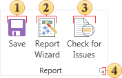
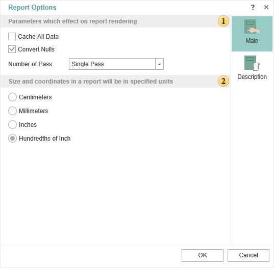
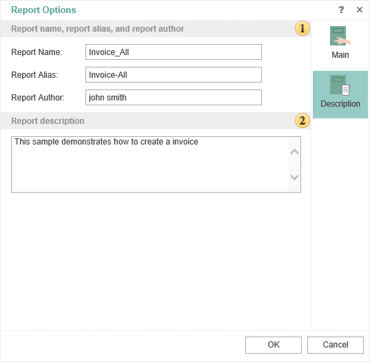

## Report

A group to control the report template.

 Select this command if you want to save the report. Saving changes will be implemented to the same item from what the report template is loaded. In addition, after you click **Save** the **Designer** window appears in which you should specify the changes. You should know that when saving the report a new copy of the report will be created. Rewriting of the old report will not happen. This is due to the fact that using the **Versions** command in the navigator, you can always refer to a specific version of the report.

 Calls the report wizard.

 Check the report for errors, messages and other information before it is rendered.

 Clicking this button you can call a box, which contains the main settings of the report.

 Parameters which affect on report rendering

* Convert **Nulls**. If the flag is checked, all **Null** values will be converted to the default values for the type. For example, you must find the arithmetic average in the prices of the product. If **Null** is not converted, the result is not correct, i.e. these values will not be considered. Therefore, you should enable this option, and then all **Null** will be converted to 0. In this case, the result of calculating the mean value will be true.

* **Number of Passes**. In most cases, one pass in the report rendering is sufficient, but sometimes there are cases when you need double pass. Consider an example. Suppose, on the last page of the report you should output some information. Before rendering of the full report, in fact we know that the account will be the last. Therefore, in this case, it is better to use a double pass when rendering a report, i.e. in the first pass the number of pages in the report will be determined and during the second pass the information on the last page will be added.

 Defining units in the report. For example, if you select centimeters then all the calculations in the report will be made in centimeters.

* The tab **Description.**

 In this field you can specify the report name and its alias and report author.

 In this field you can put any additional information of the report.
