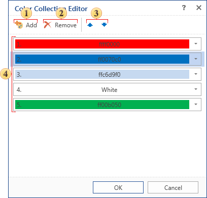

## Color Collection Editor

**Color Collection Editor** provides an opportunity to create a certain collection of colors for the style:

 The button **Add**. When you click it the collection of colors will be added. By default, the color **White** is added. Then, press 

and select the desired color.

 The button **Remove**. When you click it the selected color is removed from the collection of colors

 **Up** and **down** arrows are used to move the selected color in the list.

 The list of color collections.
