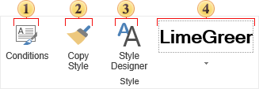

## Styles

Group controls the styles and conditions, which are used for the automatic registration of the components in the report.

 Opens a window of the Conditions Editor for selected components.

 Opens a window of the Style Editor. How it works:

  * Select the component prototype from which you will copy the style;

  * Click the button **Copy Style**;

  * Hover the cursor over components to which you want to apply the style. Press the mouse button and the style will be copied.

  * In order to exit the copy mode you should click on the button **Copy Style** again or press **Esc**.

 Calls a form to edit styles.

 The quick menu to select the style. It is a list of styles for the selected component of a particular type.
