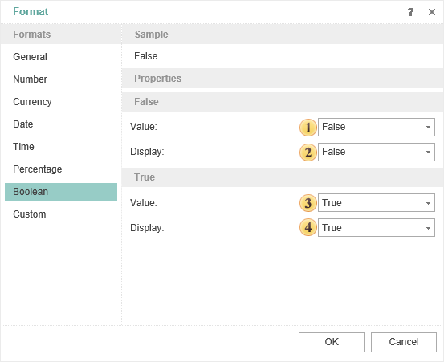

## Boolean

This format is used to format values of the Boolean type.

 The string value to identify Boolean values as false.

 The string value to represent Boolean value as false.

 The string value to represent Boolean value as true.

 The string value to represent the Boolean value as true.
