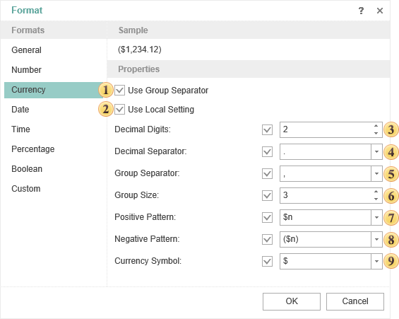

## Currency

It is used to output values as currency. The format **Currency** can be used to output other numbers.

 **Use** **Group separator**

When the Group Separator is used then currency values will be separated into number positions.

 Use **Local setting**

When using the Local settings, currency values are formatted according to the current OS installations.

 **Decimal Digits**

Number of decimal digits, which are used to format currency values.

 **Decimal Separator**

Used as a decimal separator to separate currency values in formatting.

 **Group Separator**

Used as a group separator when currency values formatting.

 **Group Size**

The number of digits in each group in currency values formatting.

 **Positive Pattern**

This pattern is used to format positive values.

 **Negative Pattern**

This pattern is used to format negative values.

 **Currency Symbol**

This symbol is used to define the currency name.
