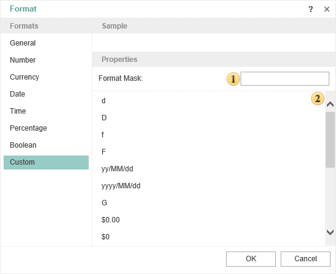

## Custom

This type is used to show values according to custom requirements. This type allows data formatting in the **Format Mask**.

 **Mask**

A string or an expression that set formatting mask.

 **Predefined Values**

The list of predefined values to format a string.
